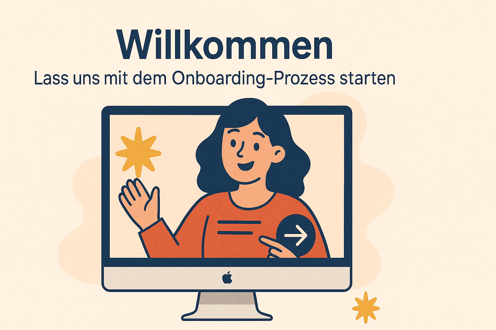

# 
Einstieg und Orientierung

<a href="#dieser-themenbereich-beinhaltet-folgende-themen">zur Kapitelübersicht</a>

---

Herzlich willkommen im offiziellen Wiki des Passionprojects **NADOO-IT** von **Christoph Backhaus IT**! 🌞 Schön, dass du deinen Weg zu uns gefunden hast. 🙌

Nimm dir einen Moment Zeit, um dich mit den ersten Seiten unserer Wissens-Bibliothek vertraut zu machen. Gerade der Themenbereich **Einstieg und Orientierung**, in dem du dich aktuell befindest, ist darauf ausgerichtet, deinen Einstieg in das NADOO-Team so reibungslos wie möglich zu gestalten.

Hier nehmen wir dich **ab Tag 1** an die Hand und helfen dir dabei, deine ersten Schritte gezielt in die richtige Richtung zu machen.

#

<h3 align="center">Das Wesentliche vorab:</h3>

#

## Direkte Aufnahme

Anstelle langer Bewerbungsverfahren wirst du **direkt** für einen **Probemonat** aufgenommen.

---

## Probemonat

In diesem Monat hast du die Chance, dich zu beweisen, indem du zeigst, dass du die **vorgegebenen Formalitäten einhältst** und **aktiv** im Team **mitarbeitest**.

---

## _Heiße Spur_ 🔥

Du hast ein bisschen getrödelt, dein erster Tag steht quasi schon mit dem Fuß in deiner Tür und jetzt fehlt dir die Zeit für's lange Lesen? Kein Ding, hier kommst du ohne Umwege zu deinem 
<a href="/docs/00-willkommen/01-leitfaden//README.md/#übersicht-dein-fahrplan-für-den-ersten-tag"><strong>First-Day-Fahrplan</strong></a>
!

### 💡 Denke aber daran, zeitnah ins Wiki zurückzukehren und deine Einarbeitung nachzuholen bzw. fortzuführen.

---

 

**_Lange Rede, kurzer Sinn_** - Lass uns den Startschuss für deine Reise durch's NADOO-versum abfeuern! 🚀

#

### Dieser Themenbereich beinhaltet folgende Themen:

#

<!-- hier Kapitelübersicht hinzufügen -->
