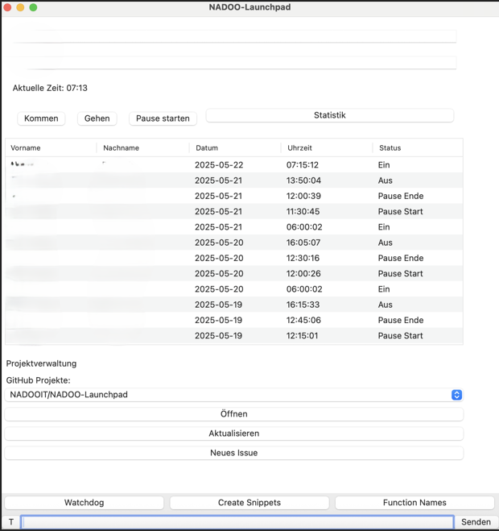
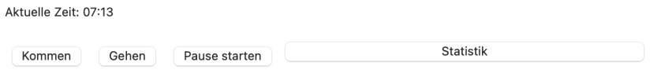
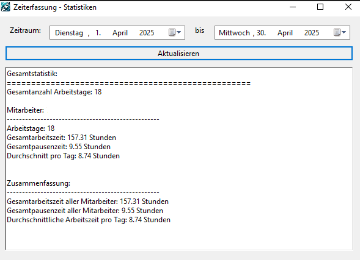
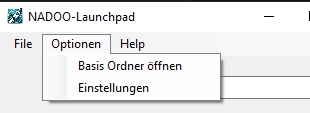
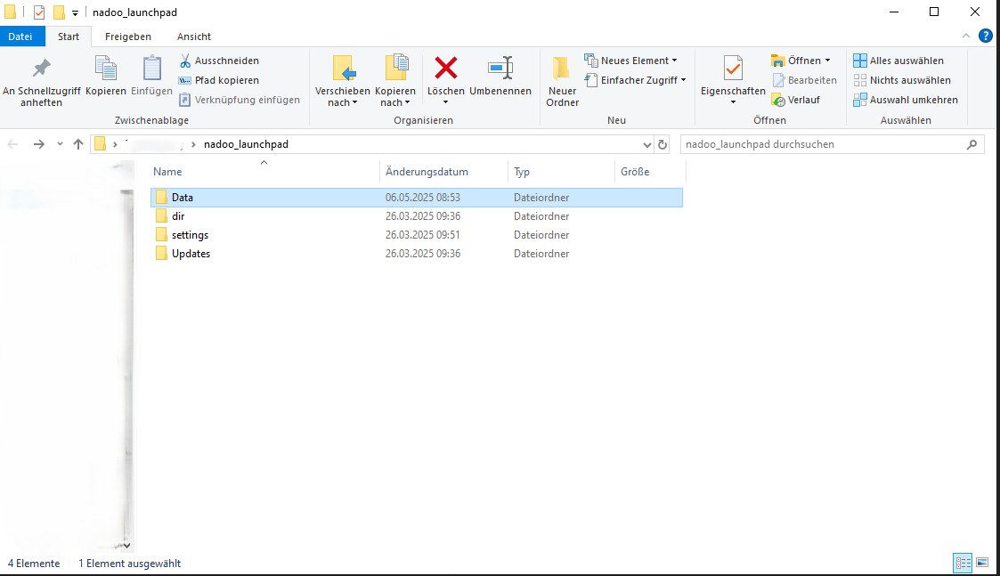
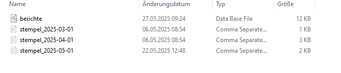
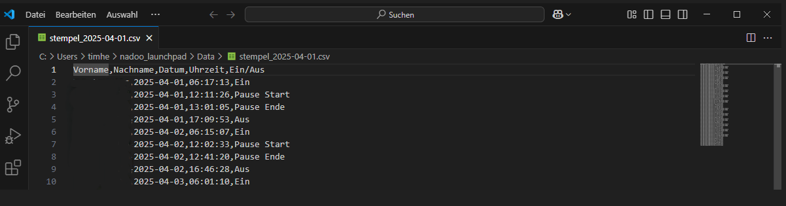

# 
Erfassung deiner Arbeits- und Pausenzeiten mit dem NADOO-Launchpad

# 
🕣Zeiterfassung - Wichtige Infos für ALLE !

Bevor wir dir alles Schritt für Schritt erklären, musst du das Wichtigste wissen : 
Unsere Zeiterfassung ist auch eine digitale Anwesenheitsbestätigung.

Jeder Mitarbeiter/in sendet **zwei E-Mails pro Tag** (Start/Ende) an <christoph.backhaus@nadooit.de> als Anwesenheitsnachweis.
## E-Mail-Betreff für Zeiterfassung
Format: MitarbeiterID_TYP_YYYY_MM_TT_HH_MM
### Beispiele
- **Einstempeln** (Tagesbeginn):
13_START_2025_09_17_08_00
- **Ausstempeln** (Tagesende):
13_ENDE_2025_09_17_16_30

*(Mitarbeiter-ID = individuelle ID. Wird im Onboardings Prozess von Christoph zur verfügung gestellt)*

**Vollzeit:**
⌛Arbeitszeit ist von 08:00 bis 16:30 Uhr. Es gibt 30 Minuten ☕Pause, die du selbs wählen kannst.
**-** Zum Beispiel entscheidest du selbst, wann du Pause macht(z.B um 11:30 oder 12:00).
**-** **Wichtig** ist nur: die Pause muss 30 Minuten dauern.

**Teilteit:**
⏳Arbeitszeit ist von 08:00 bis 14:00 Uhr. Hier gibt es 🚫keine Pause.

☝ Bitte achte darauf, deine Zeiten korrekt einzutragen !!!

Die Erfassung deiner **Arbeits- und Pausenzeiten** erfolgt über unsere Software [**NADOO-Launchpad**](https://github.com/NADOOIT/NADOO-Launchpad).

Sie ist für dich als Neueinsteiger einer der wichtigsten Punkte, der keine Sorgen auslösen oder missverständlich sein sollte. Hier erklären wir dir, wie du unser Tool - das [**NADOO-Launchpad**](https://github.com/NADOOIT/NADOO-Launchpad) - richtig für das Erfassen deiner Arbeits- und Pausenzeit verwendest und wie du Einblick in die erfassten Zeiten erhältst. 
**Vorab - alle erfassten Zeiten werden in einer CSV-Datei lokal gespeichert und sind manipulierbar, was insbesondere an deinem ersten Tag relevant sein könnte.** 
 <small>Wie du das Launchpad zum ersten Mal startest bzw. installierst, wird dir in der [**README des Launchpad-Repositories**](https://github.com/NADOOIT/NADOO-Launchpad/blob/main/README.md) erklärt. Hier zeigen wir dir, wie du deine Zeiten richtig erfassen kannst. </small> 
Nachdem du das Launchpad gestartet hast, sollte sich folgendes GUI öffnen:   <small>
Auf diesem Bild siehst du, wie es aussieht, wenn bereits Zeiten vorhanden sind.</small> 
Im oberen Bereich sind 4 Buttons, die mehr oder weniger die gesamte Zeiterfassung ausmachen und abgesehen vom "Statistik"-Button selbsterklärend sind. Der Button "Pause starten" wird zu "Pause beenden", sobald dieser ausgewählt wurde.   
Der ‘Statistik’-Button öffnet ein weiteres Fenster, in dem eine detaillierte Darstellung der Arbeitszeit in frei wählbaren Zeitabschnitten angezeigt wird.      An dieser Stelle wurde der Zeitraum 1. April bis 30. April gewählt. Nachdem du das zu bestimmende Zeitfenster für dich gewählt hast, klickst du auf "Aktualisieren", damit eine Statistik zu diesem erstellt wird. Auch Auswertungen zu einzelnen Tagen sind möglich.  
 Wenn du die CSV-Datei mit den Zeiten zur Anschau oder gegebenenfalls für deren Bearbeitung öffnen möchtest, ohne lange nach dem Ablageort zu suchen, ist folgender Schritt interessant für dich:    Wähle dazu, wie im Screenshot abgebildet,  Optionen --> Basis Ordner öffnen   aus, um das Verzeichnis mit den gespeicherten Zeiten zu öffnen.  <small>Der Ordner "Data" enthält alle deine Stempelzeiten als CSV-Datei </small>   Wie du diese öffnest, bleibt dir überlassen. In folgendem Beispiel nutzen wir VSC.  Hier kannst du aktiv die Zeiten bearbeiten und durch "speichern" werden diese auch im Launchpad aktualisiert. 
Das war's auch schon. Aktuell sind dies alle Funktionen, die das Launchpad zur Zeiterfassung bietet. Für deinen ersten Tag vielleicht auch noch ganz interessant:  <strong>Da die Zeiten lokal auf deinem PC gespeichert werden, hat kein Zweiter Zugriff darauf.</strong>
Dadurch, dass das Launchpad in der Entwicklung ist, kommen immer wieder neue Funktionen hinzu und alte Funktionen werden überarbeitet oder verschwinden. Aus diesem Grund könnten sich das hier gezeigte Interface oder bestimmte Schritte gegebenfalls von deinem aktuellen Ist-Zustand unterscheiden.

Alle weiteren Funktionen des Tools, wie es aufgebaut ist und wie du es richtig anwendest, erklärt dir unser [**Launchpad-Guide**](/docs/04-tools/05-launchpad/README.md).

---

**Dieser Themenbereich beinhaltet folgende Themen:**
---

🢒 [**Zeiterfassung / Einstempeln**](/docs/01-organisation/01-zeiterfassung/README.md)  
🢒 [**Zeit- und Ausbildungsnachweise**](/docs/01-organisation/02-zeit_und_ausbildungsnachweise/README.md)  
🢒 [**Arbeits- und Pausenzeiten**](/docs/01-organisation/03-arbeits_und_pausenzeiten/README.md) 
🢒 [**Urlaub**](/docs/01-organisation/04-urlaub/README.md)  
🢒 [**Krankmeldungen**](/docs/01-organisation/05-krankmeldungen/README.md)  
🢒 [**Mutterschutz und Elternzeit**](/docs/01-organisation/06-mutterschutz_und_elternzeit/README.md)  
🢒 [**Umgang mit Unternehmensdaten**](/docs/01-organisation/07-datenschutz/README.md)  
🢒 [**Verhalten und Kultur bei Christoph Backhaus IT — unsere Firmenphilosophien**](/docs/01-organisation/08-firmenphilosophie/README.md)  

---

📅 <strong>Dieses Dokument wurde bearbeitet am:</strong> 19.09.2025
 
✍️ <strong>Von:</strong> <a href="https://github.com/johkori">Johkori(Tim H.)</a> (GitHub)

---

<a href="/docs/01-organisation/README.md"><strong>Zurück</strong></a> | <a href="/docs/01-organisation/02-zeit_und_ausbildungsnachweise/README.md"><strong>Weiter</strong></a>

