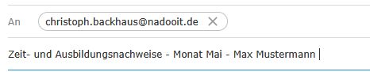

# 
Abgabe von Zeit- und Ausbildungsnachweisen

<a href="#dieser-themen-abschnitt-beinhaltet-folgende-kapitel">zur Kapitelübersicht</a>

---

### Hier sind die wichtigsten Regeln zum Thema Zeit- und Ausbildungsnachweise zusammengefasst:

#

1. Du bist verpflichtet, deinen Zeitnachweis sowie den Ausbildungsnachweis bis zum **6. des Folgemonats um 23:59 Uhr** einzureichen.

2. Wird diese Frist nicht eingehalten, erfolgt eine sofortige Kündigung.
   Diese Regelung trainiert Pünktlichkeit und termingerechtes Arbeiten – Eigenschaften, die in der Arbeitswelt hoch geschätzt werden.

3. Alle Dateien müssen via **Email** an [**christoph.backhaus@nadooit.de**](mailto:christoph.backhaus@nadooit.de) gesendet werden.

4. Als Betreff für die Email verwendest du "Zeit- und Ausbildungsnachweise - Monat - Name".     Abgesehen vom Anhang bleibt die Email leer.

#

### Dieser Themen-Abschnitt beinhaltet folgende Kapitel:

#

🔹 [**Beispiele für Ausbildungs- und Zeitnachweise**](/docs/01-organisation/02-zeit_und_ausbildungsnachweise/01-beispiele/README.md)  
🔹 [**Dateibenennungsrichtlinien**](/docs/01-organisation/02-zeit_und_ausbildungsnachweise/02-dateibenennung/README.md)  
🔹 [**Überprüfung der Dateinamen**](/docs/01-organisation/02-zeit_und_ausbildungsnachweise/03-ueberpruefung/README.md)  

---

<a href="/docs/01-organisation/01-zeiterfassung/01-launchpad-guide/README.md"><strong>Zurück</strong></a> | <a href="/docs/01-organisation/02-zeit_und_ausbildungsnachweise/01-beispiele/README.md"><strong>Weiter</strong></a>

