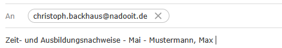

# 
Zeit- und Ausbildungsnachweise

<a href="#dieses-thema-beinhaltet-folgende-kapitel">🚀 direkt zur Kapitelübersicht</a>

---

## Hier sind die wichtigsten Regeln zum Thema Zeit- und Ausbildungsnachweise zusammengefasst:

1. Du bist verpflichtet, deine Zeit- und Ausbildungsnachweise bis zum **6. des Folgemonats um 23:59 Uhr** einzureichen.

2. Wird diese Frist nicht eingehalten, erfolgt eine **sofortige Kündigung**.
   Diese Regelung trainiert **Pünktlichkeit** und **termingerechtes Arbeiten** – Eigenschaften, die in der Arbeitswelt hoch geschätzt werden.

3. Alle Dateien müssen via **E-Mail** an [**christoph.backhaus@nadooit.de**](mailto:christoph.backhaus@nadooit.de) gesendet werden.

4. Als Betreff für die E-Mail verwendest du "**Zeit- und Ausbildungsnachweise - Monat - Name**".

 

Abgesehen vom Anhang bleibt die E-Mail leer.

---

### 
Dieses Thema beinhaltet folgende Kapitel:

---

🔹 [**Beispiele für Ausbildungs- und Zeitnachweise**](/docs/01-organisation/02-zeit_und_ausbildungsnachweise/01-beispiele/README.md)  
🔹 [**Dateibenennungsrichtlinien**](/docs/01-organisation/02-zeit_und_ausbildungsnachweise/02-dateibenennung/README.md)  
🔹 [**Überprüfung der Dateinamen**](/docs/01-organisation/02-zeit_und_ausbildungsnachweise/03-ueberpruefung/README.md)  

---

<a href="/docs/01-organisation/01-zeiterfassung/README.md"><strong>Zurück</strong></a> | 
<a href="/docs/01-organisation/02-zeit_und_ausbildungsnachweise/01-beispiele/README.md"><strong>Weiter</strong></a>

<a href="/docs/01-organisation/README.md/#dieser-themenbereich-beinhaltet-folgende-themen"><strong>Zurück zur Themen-Übersicht</strong></a> | <a href="/docs/00-willkommen/README.md"><strong>Zurück zur Startseite des Wikis</strong></a>

