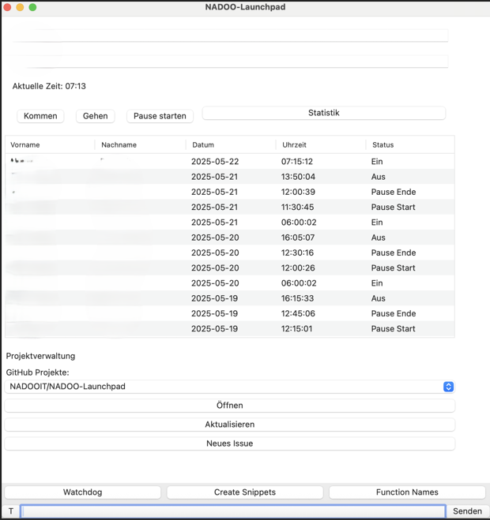
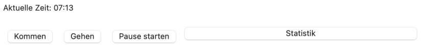
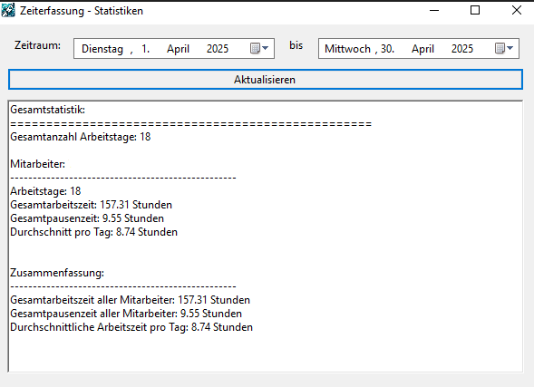
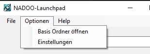
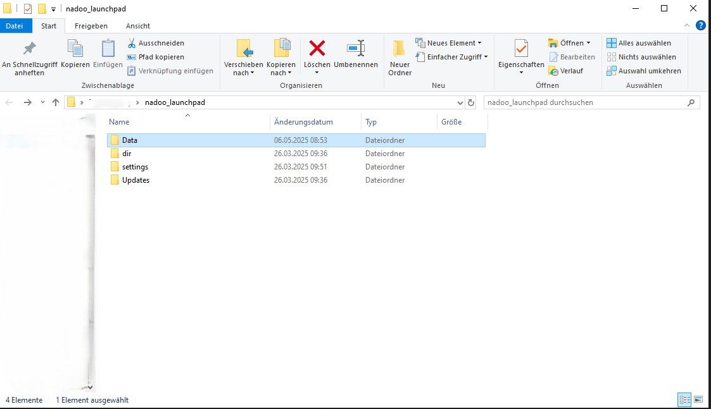
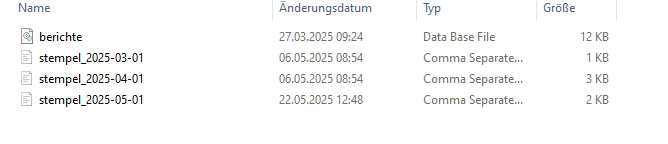
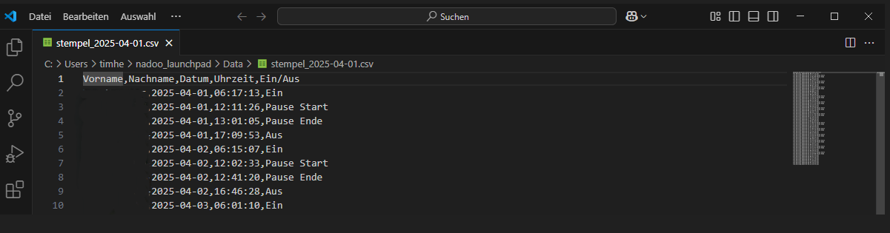

# 
Erfassung deiner Arbeits- und Pausenzeiten (Einstempeln/Ausstempeln)

**Das Wichtigste vorweg:** Die Erfasung deiner Arbeits- und Pausenzeiten besteht bei uns aus zwei, parallel ablaufenden Vorgängen. Du solltest beide Prozesse täglich ausführen.

---

## Der erste Vorgang: Die digitale Anwesenheitsbestätigung via E-Mail

Jede/r Mitarbeiter/in sendet jeweils **zwei E-Mails pro Tag** (Start des Arbeitstages/Ende des Arbeitstages) an <christoph.backhaus@nadooit.de> als Anwesenheitsnachweis.

❗ Achte hier darauf, den **Textkörper leer zu lassen** und verwende **die folgenden Formate für die Betreffzeile**:

**E-Mail für den Arbeitsbeginn (Einstempeln):** MitarbeiterID_START_YYYY_MM_TT_HH_MM  
**E-Mail zum Ende des Arbeitstages (Ausstempeln):** MitarbeiterID_ENDE_YYY_MM_TT_HH_MM

 

💡 Deine einzigartige **Mitarbeiter-ID** wird dir im Zuge des Onboarding-Prozesses von Christoph zur verfügung gestellt.

  

<h2 align="center">So sollten die Mails in etwa aussehen:</h2>

---

## Der zweite Vorgang: Die Zeiterfassung via NADOO-Launchpad

Für die [**Zeiterfassung**](/docs/01-organisation/01-zeiterfassung/README.md) verwenden wir außerdem ein internes Tool – unser [**NADOO-Launchpad**](https://github.com/NADOOIT/NADOO-Launchpad). Nutze dieses **parallel zum manuellen Versenden der Anwesenheits-E-Mails**.

### Und so geht's:

Das NADOO-Launchpad ist für dich als Neueinsteiger einer der wichtigsten Punkte, der keine Sorgen auslösen oder missverständlich sein sollte. Hier erklären wir dir, wie du unser Tool richtig für das Erfassen deiner Arbeits- und Pausenzeit verwendest und wie du Einblick in die erfassten Zeiten erhältst. 
**Vorab - alle erfassten Zeiten werden in einer CSV-Datei lokal gespeichert und sind manipulierbar, was insbesondere an deinem ersten Tag relevant sein könnte.** 
 <small>Wie du das Launchpad zum ersten Mal startest bzw. installierst, wird dir in der [**README des Launchpad-Repositories**](https://github.com/NADOOIT/NADOO-Launchpad/blob/main/README.md) erklärt. Hier zeigen wir dir, wie du deine Zeiten richtig erfassen kannst. </small> 
Nachdem du das Launchpad gestartet hast, sollte sich folgendes GUI öffnen:   <small>
Auf diesem Bild siehst du, wie es aussieht, wenn bereits Zeiten vorhanden sind.</small> 
Im oberen Bereich sind 4 Buttons, die mehr oder weniger die gesamte Zeiterfassung ausmachen und abgesehen vom "Statistik"-Button selbsterklärend sind. Der Button "Pause starten" wird zu "Pause beenden", sobald dieser ausgewählt wurde.   
Der ‘Statistik’-Button öffnet ein weiteres Fenster, in dem eine detaillierte Darstellung der Arbeitszeit in frei wählbaren Zeitabschnitten angezeigt wird.      An dieser Stelle wurde der Zeitraum 1. April bis 30. April gewählt. Nachdem du das zu bestimmende Zeitfenster für dich gewählt hast, klickst du auf "Aktualisieren", damit eine Statistik zu diesem erstellt wird. Auch Auswertungen zu einzelnen Tagen sind möglich.  
 Wenn du die CSV-Datei mit den Zeiten zur Anschau oder gegebenenfalls für deren Bearbeitung öffnen möchtest, ohne lange nach dem Ablageort zu suchen, ist folgender Schritt interessant für dich:    Wähle dazu, wie im Screenshot abgebildet,  Optionen --> Basis Ordner öffnen   aus, um das Verzeichnis mit den gespeicherten Zeiten zu öffnen.  <small>Der Ordner "Data" enthält alle deine Stempelzeiten als CSV-Datei </small>   Wie du diese öffnest, bleibt dir überlassen. In folgendem Beispiel nutzen wir VSC.  Hier kannst du aktiv die Zeiten bearbeiten und durch "speichern" werden diese auch im Launchpad aktualisiert. 
Das war's auch schon. Aktuell sind dies alle Funktionen, die das Launchpad zur Zeiterfassung bietet. Für deinen ersten Tag vielleicht auch noch ganz interessant:  <strong>Da die Zeiten lokal auf deinem PC gespeichert werden, hat kein Zweiter Zugriff darauf.</strong>
Dadurch, dass das Launchpad in der Entwicklung ist, kommen immer wieder neue Funktionen hinzu und alte Funktionen werden überarbeitet oder verschwinden. Aus diesem Grund könnten sich das hier gezeigte Interface oder bestimmte Schritte gegebenfalls von deinem aktuellen Ist-Zustand unterscheiden.

Alle weiteren Funktionen des Tools, wie es aufgebaut ist und wie du es richtig anwendest, erklärt dir unser [**Launchpad-Guide**](/docs/04-tools/05-launchpad/README.md).

---

<a href="/docs/01-organisation/01-arbeits_und_pausenzeiten/README.md"><strong>Zurück</strong></a> | <a href="/docs/01-organisation/03-zeit_und_ausbildungsnachweise/README.md"><strong>Weiter</strong></a>

<a href="/docs/01-organisation/README.md/#dieser-themenbereich-beinhaltet-folgende-themen"><strong>Zurück zur Themen-Übersicht</strong></a> | <a href="/docs/00-willkommen/README.md"><strong>Zurück zur Startseite des Wikis</strong></a>

---

Kompletten Themenbereich anzeigen

 

  &nbsp;&nbsp;🔹 [Arbeitszeit und Pausen](docs/01-organisation/01-arbeits_und_pausenzeiten/README.md)  
  &nbsp;&nbsp;🔹 [Erfassung deiner Arbeits- und Pausenzeiten mit dem NADOO-Launchpad](docs/01-organisation/02-zeiterfassung/README.md)  
#
📄 [zum Thema **Zeit- und Ausbildungsnachweise:**](docs/01-organisation/03-zeit_und_ausbildungsnachweise/README.md)  
  &nbsp;&nbsp;🔹 [Beispiele für Ausbildungs- und Zeitnachweise](docs/01-organisation/02-zeit_und_ausbildungsnachweise/01-beispiele/README.md)  
  &nbsp;&nbsp;🔹 [Dateibenennungsrichtlinien](docs/01-organisation/02-zeit_und_ausbildungsnachweise/02-dateibenennung/README.md)  
  &nbsp;&nbsp;🔹 [Überprüfung der Dateinamen](/docs/01-organisation/02-zeit_und_ausbildungsnachweise/03-ueberpruefung/README.md)  
#
  &nbsp;&nbsp;🔹 [Regelungungen für Urlaub und Freistellungen](docs/01-organisation/04-urlaub/README.md)  
  &nbsp;&nbsp;🔹 [Ablauf bei Krankmeldungen](docs/01-organisation/05-krankmeldungen/README.md)  
  &nbsp;&nbsp;🔹 [Gesetzliche Regelungen zu Mutterschutz und Elternzeit](/docs/01-organisation/06-mutterschutz_und_elternzeit/README.md)  
  &nbsp;&nbsp;🔹 [Umgang mit Unternehmensdaten bei Christoph Backhaus IT — Sicherheit und Vertraulichkeit als oberste Priorität](/docs/01-organisation/07-datenschutz/README.md)  
  #
📄 [zum Thema **Umgang und Kultur bei Christoph Backhaus IT — unsere Firmenphilosophien:**](docs/01-organisation/03-zeit_und_ausbildungsnachweise/README.md)  
  &nbsp;&nbsp;🔹 [Unsere Verhaltensregeln](/docs/01-organisation/08-firmenphilosophie/01-verhaltensregeln/README.md)  
  &nbsp;&nbsp;🔹 [Meinungsaustausch bei Christoph Backhaus IT: eine Kultur, die von Feedback lebt](/docs/01-organisation/08-firmenphilosophie/02-feedback-kultur/README.md)  
  &nbsp;&nbsp;🔹 [KAIZEN bei Christoph Backhaus IT: eine Kultur der kontinuierlichen Verbesserung](/docs/01-organisation/08-firmenphilosophie/03-kaizen/README.md)  

