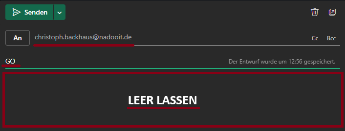

# 
Erfassung deiner Arbeits- und Pausenzeiten (Einstempeln/Ausstempeln)

Die Erfassung deiner Arbeitszeit erfolgt bei uns via E-Mail. **Diesen Prozess musst du täglich ausführen**, sonst wird deine Anwesenheit nicht erfasst.

---

## Die digitale Anwesenheitsbestätigung via E-Mail

Jede/r Mitarbeiter/in sendet **morgens zum Arbeitsbeginn** jeweils **eine E-Mail pro Tag** an <christoph.backhaus@nadooit.de> als Anwesenheitsnachweis. Nutze dabei das folgende Format:

**Betreffzeile** (Einstempeln): **GO**

❗ Achte hier darauf, den Textkörper (Body) leer zu lassen.

💡 Das Ausstempeln erfolgt automatisch und ist immer auf 16:30 Uhr gesetzt. 

**Betreffzeile (Ausstempeln ohne Meeting): GO silent**

❌ Achte hier darauf, den Textkörper (Body) leer zu lassen.

💪 Diese Variante ist für dich interessant, wenn du keinen Meeting-Termin mit deinen Kolleg*innen hast, aber trotzdem ausstempeln möchtest. 

Sende einfach eine E-Mail mit dem Betreff **GO silent** an [christoph.backhaus@nadooit.de](mailto:christoph.backhaus@nadooit.de), um deine Arbeitszeit ohne ein Meeting zu beenden.

---

<!-- hier nochmal mit Christoph klären inwieweit nun die mit dem Launchpad erfassten Zeiten/csv-Dateien verwertet werden sollen -->

## Erfassung von Arbeits- und Pausenzeiten via NADOO-Launchpad

Zusätzlich verwenden wir ein internes Tool – unser [**NADOO-Launchpad**](https://github.com/NADOOIT/NADOO-Launchpad) - für die Erfassung von Arbeits- und Pausenzeiten. 

### Und so geht's:

Das NADOO-Launchpad ist für dich als Neueinsteiger einer der wichtigsten Punkte, der keine Sorgen auslösen oder missverständlich sein sollte. Hier erklären wir dir, wie du unser Tool richtig für das Erfassen deiner Arbeits- und Pausenzeit verwendest und wie du Einblick in die erfassten Zeiten erhältst. 
**Vorab - alle erfassten Zeiten werden in einer CSV-Datei lokal gespeichert und sind manipulierbar, was insbesondere an deinem ersten Tag relevant sein könnte.** 
 <small>Wie du das Launchpad zum ersten Mal startest bzw. installierst, wird dir in der [**README des Launchpad-Repositories**](https://github.com/NADOOIT/NADOO-Launchpad/blob/main/README.md) erklärt. Hier zeigen wir dir, wie du deine Zeiten richtig erfassen kannst. </small> 
Nachdem du das Launchpad gestartet hast, sollte sich folgendes GUI öffnen:   <small>
Auf diesem Bild siehst du, wie es aussieht, wenn bereits Zeiten vorhanden sind.</small> 
Im oberen Bereich sind 4 Buttons, die mehr oder weniger die gesamte Zeiterfassung ausmachen und abgesehen vom "Statistik"-Button selbsterklärend sind. Der Button "Pause starten" wird zu "Pause beenden", sobald dieser ausgewählt wurde.   
Der ‘Statistik’-Button öffnet ein weiteres Fenster, in dem eine detaillierte Darstellung der Arbeitszeit in frei wählbaren Zeitabschnitten angezeigt wird.      An dieser Stelle wurde der Zeitraum 1. April bis 30. April gewählt. Nachdem du das zu bestimmende Zeitfenster für dich gewählt hast, klickst du auf "Aktualisieren", damit eine Statistik zu diesem erstellt wird. Auch Auswertungen zu einzelnen Tagen sind möglich.  
 Wenn du die CSV-Datei mit den Zeiten zur Anschau oder gegebenenfalls für deren Bearbeitung öffnen möchtest, ohne lange nach dem Ablageort zu suchen, ist folgender Schritt interessant für dich:    Wähle dazu, wie im Screenshot abgebildet,  Optionen --> Basis Ordner öffnen   aus, um das Verzeichnis mit den gespeicherten Zeiten zu öffnen.  <small>Der Ordner "Data" enthält alle deine Stempelzeiten als CSV-Datei </small>   Wie du diese öffnest, bleibt dir überlassen. In folgendem Beispiel nutzen wir VSC.  Hier kannst du aktiv die Zeiten bearbeiten und durch "speichern" werden diese auch im Launchpad aktualisiert. 
Das war's auch schon. Aktuell sind dies alle Funktionen, die das Launchpad zur Zeiterfassung bietet. Für deinen ersten Tag vielleicht auch noch ganz interessant:  <strong>Da die Zeiten lokal auf deinem PC gespeichert werden, hat kein Zweiter Zugriff darauf.</strong>
Dadurch, dass das Launchpad in der Entwicklung ist, kommen immer wieder neue Funktionen hinzu und alte Funktionen werden überarbeitet oder verschwinden. Aus diesem Grund könnten sich das hier gezeigte Interface oder bestimmte Schritte gegebenfalls von deinem aktuellen Ist-Zustand unterscheiden.

Alle weiteren Funktionen des Tools, wie es aufgebaut ist und wie du es richtig anwendest, erklärt dir unser [**Launchpad-Guide**](/docs/04-tools/06-launchpad/README.md). 

---

<a href="/docs/01-organisation/01-arbeits_und_pausenzeiten/README.md"><strong>Zurück</strong></a> | <a href="/docs/01-organisation/03-zeit_und_ausbildungsnachweise/README.md"><strong>Weiter</strong></a>

<a href="/docs/01-organisation/README.md/#dieser-themenbereich-beinhaltet-folgende-themen"><strong>Zurück zur Themen-Übersicht</strong></a> | <a href="/docs/00-willkommen/README.md"><strong>Zurück zur Startseite des Wikis</strong></a>

