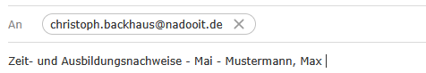

# 
Zeit- und Ausbildungsnachweise

<a href="#dieses-thema-beinhaltet-folgende-kapitel">🚀 Direkt zur Kapitel-Übersicht</a>

---

## Hier sind die wichtigsten Regeln zum Thema Zeit- und Ausbildungsnachweise zusammengefasst:

1. Du bist verpflichtet, deine Zeit- und Ausbildungsnachweise bis zum **6. des Folgemonats um 23:59 Uhr** einzureichen.

2. Wird diese Frist nicht eingehalten, erfolgt eine **sofortige Kündigung**.
   Diese Regelung trainiert **Pünktlichkeit** und **termingerechtes Arbeiten** – Eigenschaften, die in der Arbeitswelt hoch geschätzt werden.

3. Alle Dateien müssen via **E-Mail** an [**christoph.backhaus@nadooit.de**](mailto:christoph.backhaus@nadooit.de) gesendet werden.

4. Als Betreff für die E-Mail verwendest du "**Zeit- und Ausbildungsnachweise - Monat - Name**".

 

Abgesehen vom Anhang bleibt die E-Mail leer.

---

### 
Dieses Thema beinhaltet folgende Kapitel:

---

🔹 [**Beispiele für Ausbildungs- und Zeitnachweise**](/docs/01-organisation/02-zeit_und_ausbildungsnachweise/01-beispiele/README.md)  
🔹 [**Dateibenennungsrichtlinien**](/docs/01-organisation/02-zeit_und_ausbildungsnachweise/02-dateibenennung/README.md)  
🔹 [**Überprüfung der Dateinamen**](/docs/01-organisation/02-zeit_und_ausbildungsnachweise/03-ueberpruefung/README.md)  

---

<a href="/docs/01-organisation/02-zeiterfassung/README.md"><strong>Zurück</strong></a> | 
<a href="/docs/01-organisation/03-zeit_und_ausbildungsnachweise/01-beispiele/README.md"><strong>Weiter</strong></a>

<a href="/docs/01-organisation/README.md/#dieser-themenbereich-beinhaltet-folgende-themen"><strong>Zurück zur Themen-Übersicht</strong></a> | <a href="/docs/00-willkommen/README.md"><strong>Zurück zur Startseite des Wikis</strong></a>

---

Kompletten Themenbereich anzeigen

 

  &nbsp;&nbsp;🔹 [Arbeitszeit und Pausen](docs/01-organisation/01-arbeits_und_pausenzeiten/README.md)  
  &nbsp;&nbsp;🔹 [Erfassung deiner Arbeits- und Pausenzeiten mit dem NADOO-Launchpad](docs/01-organisation/02-zeiterfassung/README.md)  
#
📄 [zum Thema **Zeit- und Ausbildungsnachweise:**](docs/01-organisation/03-zeit_und_ausbildungsnachweise/README.md)  
  &nbsp;&nbsp;🔹 [Beispiele für Ausbildungs- und Zeitnachweise](docs/01-organisation/02-zeit_und_ausbildungsnachweise/01-beispiele/README.md)  
  &nbsp;&nbsp;🔹 [Dateibenennungsrichtlinien](docs/01-organisation/02-zeit_und_ausbildungsnachweise/02-dateibenennung/README.md)  
  &nbsp;&nbsp;🔹 [Überprüfung der Dateinamen](/docs/01-organisation/02-zeit_und_ausbildungsnachweise/03-ueberpruefung/README.md)  
#
  &nbsp;&nbsp;🔹 [Regelungungen für Urlaub und Freistellungen](docs/01-organisation/04-urlaub/README.md)  
  &nbsp;&nbsp;🔹 [Ablauf bei Krankmeldungen](docs/01-organisation/05-krankmeldungen/README.md)  
  &nbsp;&nbsp;🔹 [Gesetzliche Regelungen zu Mutterschutz und Elternzeit](/docs/01-organisation/06-mutterschutz_und_elternzeit/README.md)  
  &nbsp;&nbsp;🔹 [Umgang mit Unternehmensdaten bei Christoph Backhaus IT — Sicherheit und Vertraulichkeit als oberste Priorität](/docs/01-organisation/07-datenschutz/README.md)  
  #
📄 [zum Thema **Umgang und Kultur bei Christoph Backhaus IT — unsere Firmenphilosophien:**](docs/01-organisation/03-zeit_und_ausbildungsnachweise/README.md)  
  &nbsp;&nbsp;🔹 [Unsere Verhaltensregeln](/docs/01-organisation/08-firmenphilosophie/01-verhaltensregeln/README.md)  
  &nbsp;&nbsp;🔹 [Meinungsaustausch bei Christoph Backhaus IT: eine Kultur, die von Feedback lebt](/docs/01-organisation/08-firmenphilosophie/02-feedback-kultur/README.md)  
  &nbsp;&nbsp;🔹 [KAIZEN bei Christoph Backhaus IT: eine Kultur der kontinuierlichen Verbesserung](/docs/01-organisation/08-firmenphilosophie/03-kaizen/README.md)  

