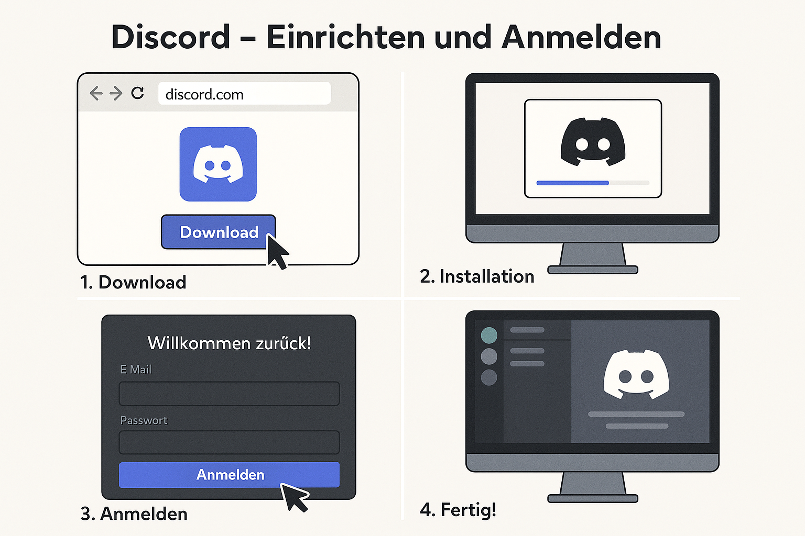

# Discord - Einrichten und Anmelden

Discord ist unser **zentrales Kommunikationstool** bei NADOO-IT.

So richtest du es ein und meldest Dich an:

---

## 🧩 Schritt 1: Download

Besuche [discord.com/download](https://discord.com/download) und lade dir die App für dein Betriebssystem (Windows, macOS, Linux) herunter.

---

## 🖥️ Schritt 2: Installation

Öffne die heruntergeladene Datei und folge den Installationsanweisungen für dein Betriebssystem.

---

## 🔐 Schritt 3: Anmelden

Starte Discord und melde dich mit Deiner E-Mail-Adresse und Deinem Passwort an. Falls du noch keinen Account hast, kannst du direkt einen erstellen.

---

## ✅ Schritt 4: Fertig

Nach dem Login siehst Du die Benutzeroberfläche von Discord. Du wirst von uns per Einladungslink zum NADOO-Server eingeladen. Dort findest Du alle wichtigen Kanäle und Infos.

📌 Hinweis: Aktiviere ggf. die Desktop-Benachrichtigungen, damit du keine wichtigen Nachrichten verpasst.

Das war's! Du bist jetzt bereit, Discord für die Kommunikation bei NADOO-IT zu nutzen 😄

---

## 📞 Schritt 5: Hilfe

Wenn Du Fragen hast oder Unterstützung benötigst, kannst Du Dich jederzeit an den Support-Kanal wenden.

Dort helfen Dir unsere erfahrenen Kolleginnen und Kollegen gerne weiter.

---

[Zurück](../README.md) zur Übersicht | [Android-Webcam](../../02-webcam/01-droidcam/README.md) | [iOS-Integrationskamera](../../02-webcam/02-ios/README.md)
