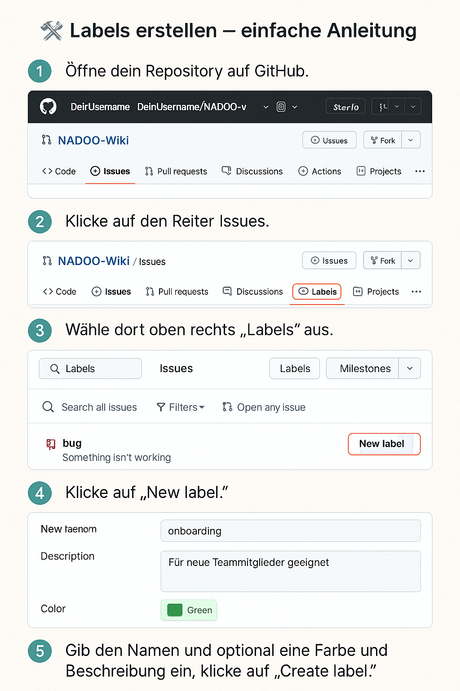

# 
Labels

## Empfohlene GitHub Labels für NADOO-Projekte

Um Issues im Projekt übersichtlich zu strukturieren, empfehlen wir als Beispiel die Verwendung folgender Labels:

### ✅ Empfohlene Labels

| Label | Zweck |
| :--- | ---|
| onboarding | Markiert Aufgaben, die sich gut für neue Teammitglieder eignen – ideal zum Einstieg ins Projekt. |
| wiki | Kennzeichnet Issues, die mit der Dokumentation oder dem NADOO-Wiki zusammenhängen. |
| wip | (Work in Progress) Wird verwendet, wenn ein Task bereits begonnen wurde, aber noch in Arbeit ist. |
| bug | Kennzeichnet Fehler, die im Code gefunden wurden. |
| enhancement | Für Verbesserungen oder neue Features, die in das Projekt integriert werden sollen. |
| question | Für Fragen, die im Projekt geklärt werden müssen. |
| discussion | Für Diskussionen, die im Projekt geführt werden müssen. |
| help-wanted | Für Aufgaben, bei denen Hilfe benötigt wird. |
| ... | Weitere Labels können je nach Bedarf hinzugefügt werden. |

---

## 🛠️ Labels erstellen – einfache Anleitung

1. **Öffne dein Repository auf GitHub**  
Navigiere zur Startseite des Projekts (z. B. [https://github.com/DeinUsername/NADOO-Wiki](https://github.com/DeinUsername/NADOO-Wiki)).

2. **Klicke auf den Reiter Issues**  
Wähle oben den Reiter „Issues“ aus.

3. **Wähle „Labels“ aus**  
Direkt neben „Milestones“ findest du den Punkt „Labels“. Klicke darauf.

4. **Neues Label erstellen**  

- Klicke auf die Schaltfläche **New label**.  
- Gib den Namen ein (z. B. `Onboarding`).  
- Wähle optional eine Farbe, z. B.:  
- `Onboarding` → Blau  
- `Wiki` → Blau  
- `WIP` → Gelb  
- Schreibe eine kurze Beschreibung, z. B. „Für neue Teammitglieder geeignet“.

5. **Speichern**  

Klicke auf **Create label** – fertig!

---

Diese Labels helfen dir und dem Team, Aufgaben schnell zu finden und sinnvoll einzuordnen.

## Weitere Informationen

[GitHub Docs: Labels](https://docs.github.com/de/issues/using-labels-and-milestones-to-track-work/managing-labels)

---

<a href="/docs/04-tools/01-github/04-issues/01-wiki-guide/README.md"><strong>Zurück</strong></a> | 
<a href="/docs/04-tools/01-github/04-issues/03-types/README.md"><strong>Weiter</strong></a>

<a href="/docs/04-tools/01-github/04-issues/README.md/#dieses-kapitel-beinhaltet-folgende-abschnitte"><strong>Zurück zur Abschnitts-Übersicht</strong></a> | <a href="/docs/00-willkommen/README.md"><strong>Zurück zur Startseite des Wikis</strong></a>

