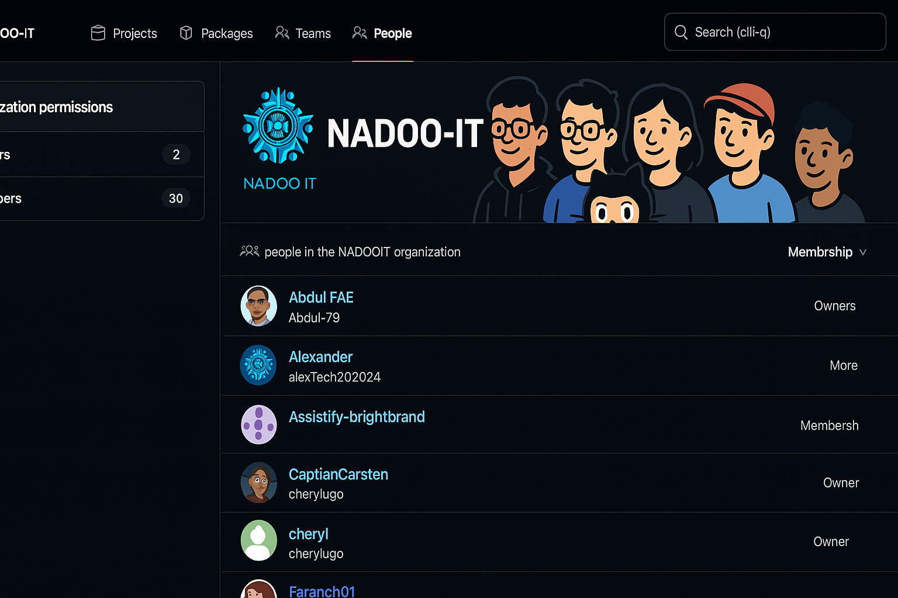
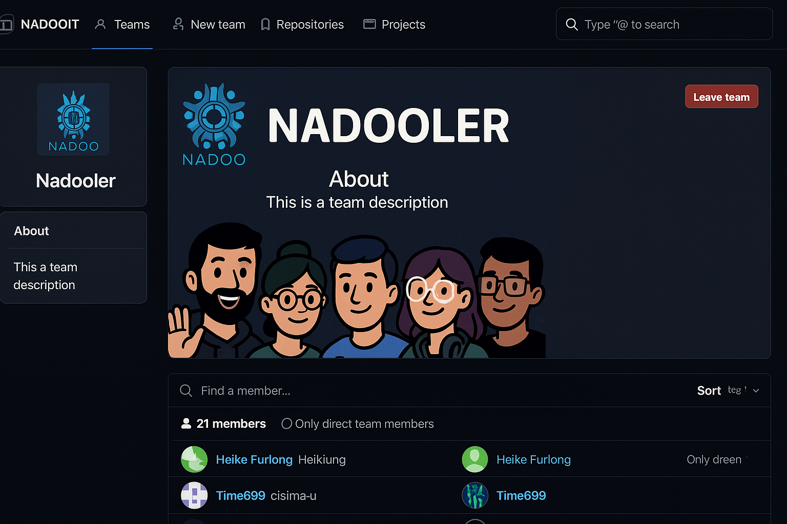

# Schritt-für-Schritt-Anleitung zur NADOO-IT-Organisation und den Teams auf GitHub

## 📖 Inhalt

Zu Beginn deines Praktikums erhältst du eine persönliche Einladung per E-Mail zur GitHub-Organisation **NADOO-IT**.

### 📨 Einladung bestätigen

1. Prüfe dein Postfach auf eine Einladung von `noreply@github.com`.
2. Klicke auf **“Join organization”**, um deine Mitgliedschaft zu bestätigen.
3. Falls du noch kein GitHub-Konto hast, wirst du aufgefordert, eines zu erstellen.

### 👥 Beitritt zum Team **NADOOler**

Nach deiner Bestätigung wirst du automatisch dem internen Team **NADOOler** zugewiesen.

**Über:**  
Das Team **NADOOler** besteht aus allen aktiven Mitwirkenden innerhalb der NADOO-IT Organisation. Hier findet der direkte Austausch, die Zuweisung zu Projekten sowie die teamübergreifende Koordination statt.

Dieses Team dient der Kommunikation und dem Zugriff auf gemeinsame Repositories und Projekte.

Falls du nach 24 Stunden keine Einladung erhalten hast oder Probleme auftreten, melde dich bitte per Mail bei [Christoph](mailto:christoph.backhaus@nadooit.de).

---

### 🛠️ Zugriff auf Repositories

Nachdem du die Einladung zur Organisation und dem Team angenommen hast, erhältst du Zugriff auf verschiedene Repositories.

Diese enthalten die Projekte, an denen du mitarbeiten kannst.

Prüfe bitte direkt nach dem Beitritt, ob du Zugriff auf die folgenden Repositories hast:

- [NADOO-Launchpad](https://github.com/NADOOIT/NADOO-Launchpad): Das Repository für die Applikation NADOO-Launchpad
- [NADOO-Academy](https://github.com/NADOOIT/NADOO-Academy): Das Repository für die NADOO-Academy mit Lerninhalten und Schulungen
- [NADOO-Wiki](https://github.com/NADOOIT/NADOO-Wiki): Das Repository für das Wiki zur Dokumentation der Lernplattform des Unternehmens
- [NADOO-IT](https://github.com/NADOOIT/NADOO-IT): Das Repository für die NADOO-IT-Website und das Framework des Unternehmens

---

### 🆘 Hilfe und Support

Sollte es zu Problemen mit GitHub kommen und du dringend Hilfe benötigst, kannst du dich auch direkt über Discord an die Teammitglieder wenden.

---

<!-- Links nach Absprache der Struktur ergänzen -->

---

