# 
Installationsguide Windsurf

<h3>❗💡 Hinweis: Alle&nbsp;&nbsp;▶&nbsp;&nbsp;sind aufklappbar</h3>

## Windsurf

Windsurf basiert auf Visual Studio Code (VS Code) und fühlt sich für Nutzer der IDE daher vertraut an. Dadurch können Entwickler schneller programmieren, machen weniger Fehler und erreichen eine höhere Produktivität. Lass uns nun die Systemanforderungen und Installationsschritte anhand des Betriebssystems Windows durchgehen.

---

## Systemanforderungen für Windsurf

Um eine reibungslose Installation zu gewährleisten, überprüfe, ob dein System die Anforderungen von Windsurf erfüllt:

**Windows:** Windows 10/11 (x64 oder ARM64), 8 GB RAM (16 GB empfohlen), 2 GB freier Festplattenspeicher.

**Internet:** Zum Herunterladen und Synchronisieren von Plugins erforderlich.

---

## Windsurf-Konto registrieren

Zunächst suchst du im Internet über eine Suchmaschine nach **Windsurf** oder **IDE Windsurf** und wählst in der Regel den ersten Eintrag.

<strong>Beispielbild</strong>

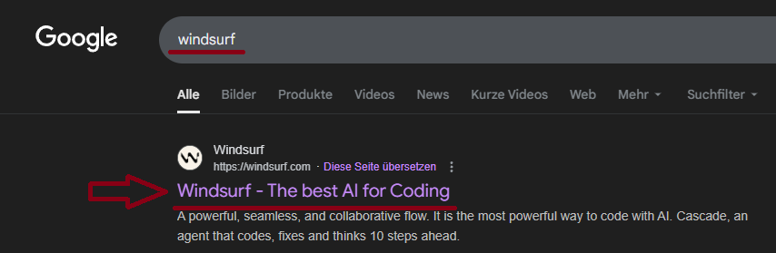

 

---

Jetzt kannst du dich oben rechts über das Profil-Symbol für die Nutzung von Windsurf registrieren. Klicke dafür auf das **Profilbild**.

<strong>Beispielbild</strong>

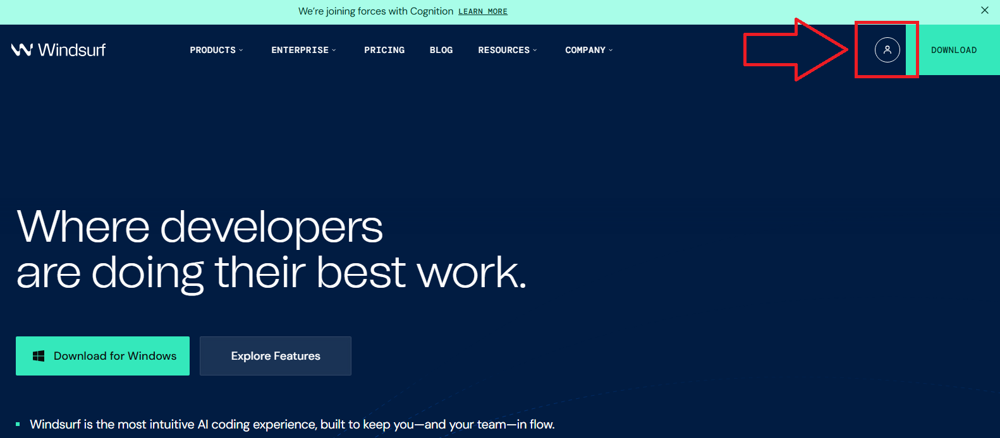

 

---

Klicke auf den Link **Sign Up**, wie auf dem Bild unten zu sehen.

<strong>Beispielbild</strong>

 

---

Fülle die Anmeldemaske mit deinen Daten aus und klicke auf **Continue**, oder nutze einen vorhandenen Google- oder GitHub-Account.

<strong>Beispielbild</strong>

 

---

## Herunterladen und Installieren von Windsurf unter Windows

### Schritt 1: Lade das Windsurf-Installationsprogramm herunter

Auf der Seite suchst du nach **Download** für Windows, lädst die Datei herunter, führst sie aus und folgst der Anleitung auf dem Bildschirm.

<strong>Beispielbild</strong>

 

---

Es öffnet sich ein weiteres Fenster, in dem du die **Variante x64** auswählst (die meisten Windows-Betriebssysteme laufen auf x64).

<strong>Beispielbild</strong>

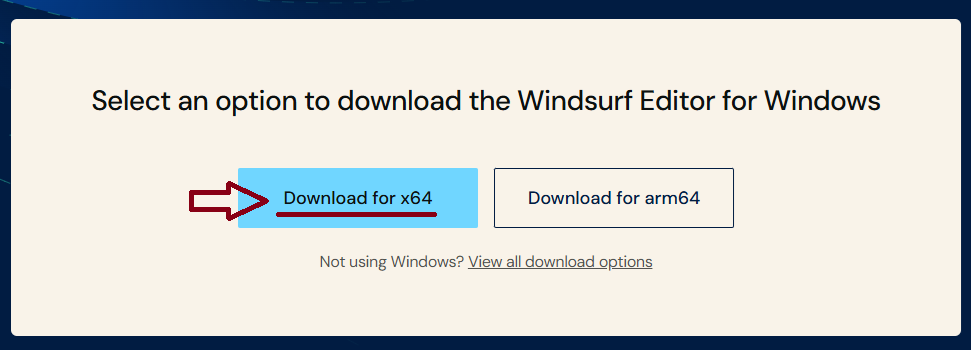

 

---

Im Download-Fenster klickst du anschließend auf **Öffnen**.

<strong>Beispielbild</strong>

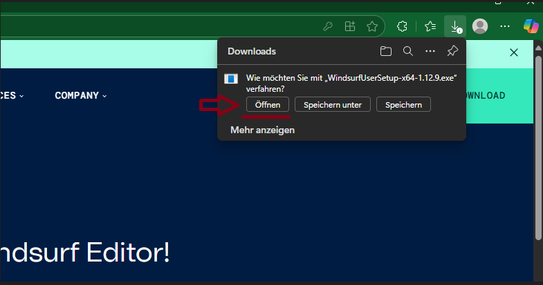

 

Windows zeigt möglicherweise eine Benutzerkontensteuerung (UAC)-Aufforderung an. Klicke auf **Ja**, um fortzufahren. Der Setup-Assistent öffnet sich und führt dich durch den Prozess.

---

Bestätige die Lizenzvereinbarungen mit **Weiter**.

<strong>Beispielbild</strong>

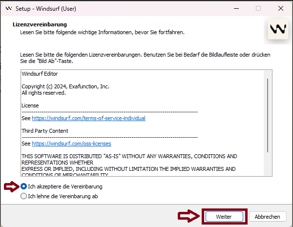

 

---

Als bevorzugtes Installationsverzeichnis wählst du das vorgeschlagene Standardverzeichnis und klickst danach auf **Weiter**.

<strong>Beispielbild</strong>

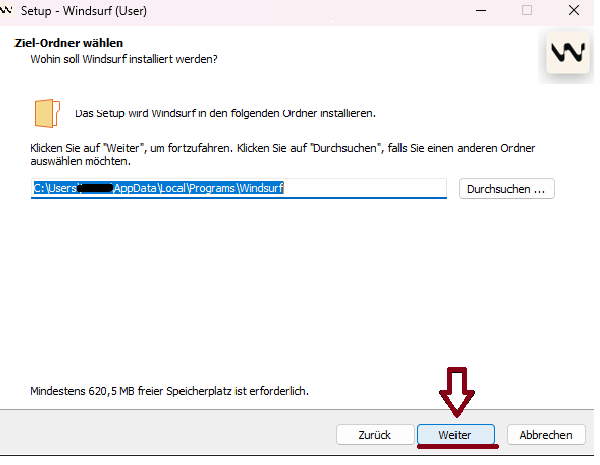

 

---

Wenn du einen Startmenü-Ordner erstellen möchtest, klicke auf **Weiter** und warte, bis die Installation abgeschlossen ist.

<strong>Beispielbild</strong>

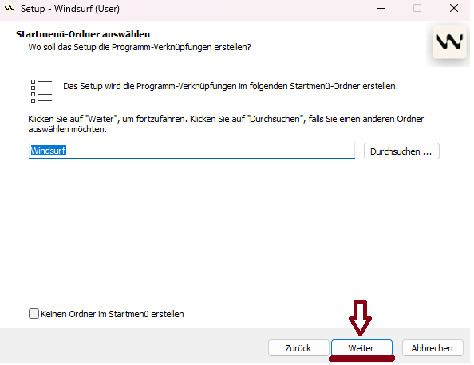

 

---

Wähle, ob du ein Desktop-Symbol haben möchtest (siehe roter Pfeil), und klicke anschließend auf **Weiter**.

<strong>Beispielbild</strong>

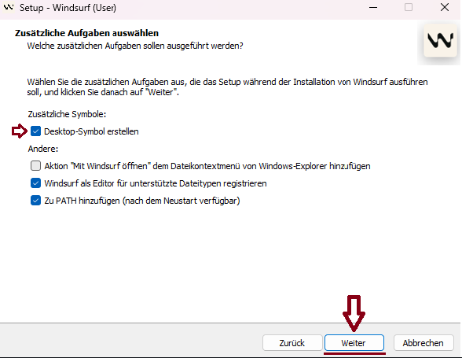

 

---

Überprüfe deine Installationsangaben und klicke anschließend auf **Installieren**.

<strong>Beispielbild</strong>

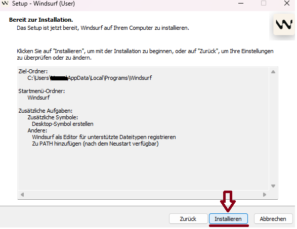

 

---

Alternativ kannst du Windsurf auch als **Plugin in Visual Studio Code** nutzen. Hierfür benötigst du natürlich VS Code. Öffne dort die **Extensions**-Ansicht in der linken Seitenleiste und suche nach dem Plugin.

<strong>Beispielbild</strong>

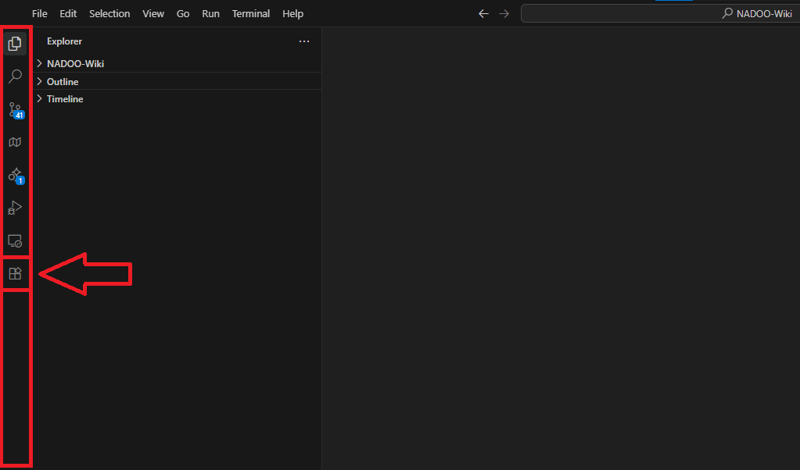

 

---

Gib oben ins Suchfeld **Windsurf** ein.

<strong>Beispielbild</strong>

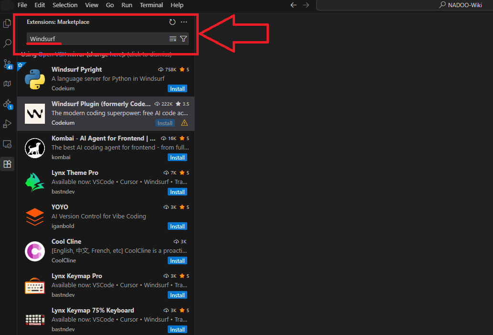

 

---

Klicke dann auf den blauen Button **Installieren**.

<strong>Beispielbild</strong>

 

---

Nach Abschluss der Installation wirst du aufgefordert, das Plugin mit deinem Windsurf-Konto zu verbinden. Folge dazu den Anweisungen.

Du kannst Windsurf natürlich auch auf anderen Betriebssystemen nutzen. Anleitungen zur Installation für das Betriebssystem deiner Wahl findest du im Internet.

---

### Schritt 2: Windsurf einrichten

Aktiviere nach Abschluss der Installation das Kontrollkästchen, um Windsurf sofort zu starten. Solltest du nicht automatisch angemeldet sein, musst du dich an dieser Stelle erneut anmelden.

---

### Schritt 3: VS Code-Einstellungen synchronisieren

Da Windsurf auf VS Code basiert, importiert es automatisch deine vorhandenen VS Code-Plugins und -Einstellungen, falls du bereits damit gearbeitet hast. Navigiere dazu zum Menü **Einstellungen**, wähle **VS Code-Einstellungen synchronisieren** und folge den Bildschirmanweisungen.

---

### Schritt 4: Installation testen

Um zu prüfen, ob Windsurf korrekt installiert wurde, erstelle am besten ein neues Projekt und teste einige Funktionen. Und wenn du schon dabei bist, kannst du unten rechts deine bevorzugte KI auswählen, die dich beim Programmieren unterstützt.

Jetzt kannst du Windsurf für deine spannenden Projekte nutzen! 👍

---

<a href="/docs/04-tools/04-windsurf/01-ueberblick/README.md"><strong>Zurück</strong></a> | <a href="/docs/04-tools/04-windsurf/01-ueberblick/02-api_anbindungen_und_externe_modelle/README.md"><strong>Weiter</strong></a>

<a href="/docs/04-tools/04-windsurf/README.md/#dieses-thema-beinhaltet-folgende-kapitel"><strong>Zurück zur Kapitel-Übersicht</strong></a> | <a href="/docs/00-willkommen/README.md"><strong>Zurück zur Startseite des Wikis</strong></a>

