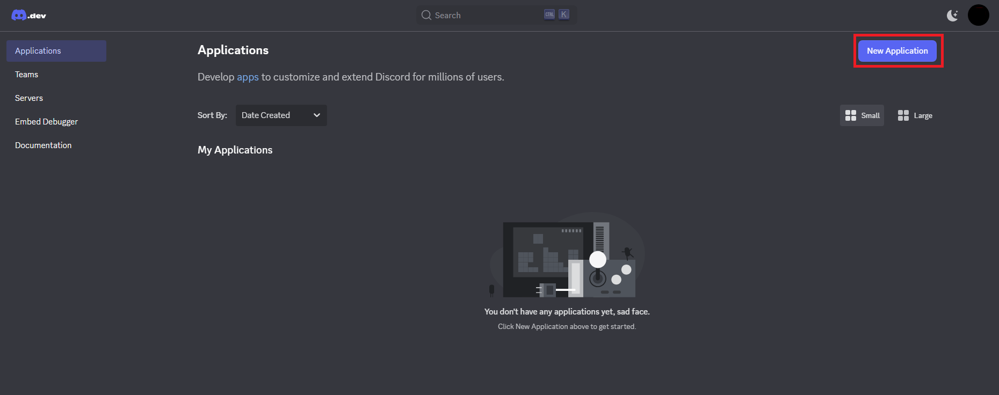
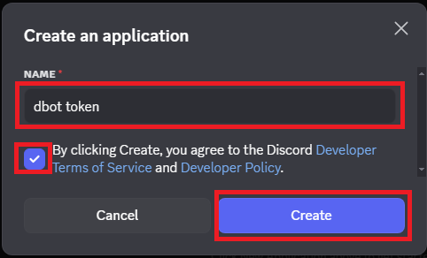
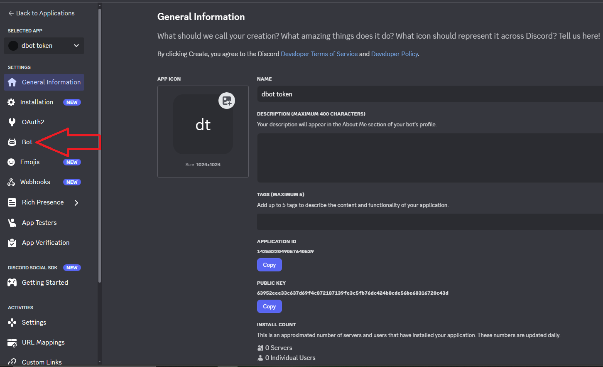
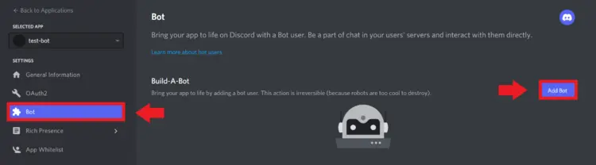
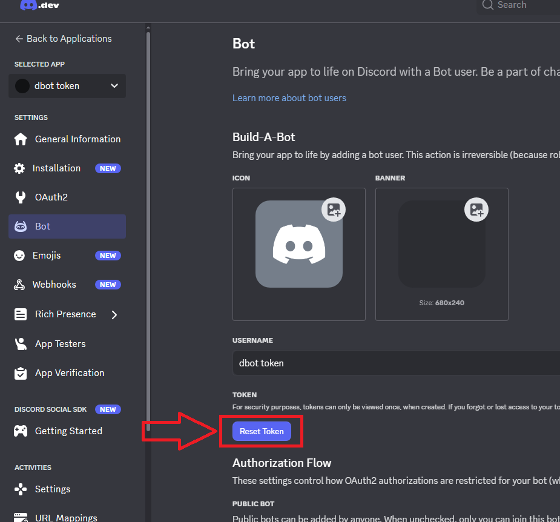
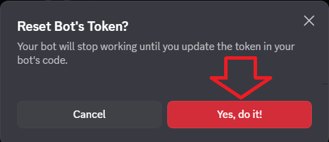
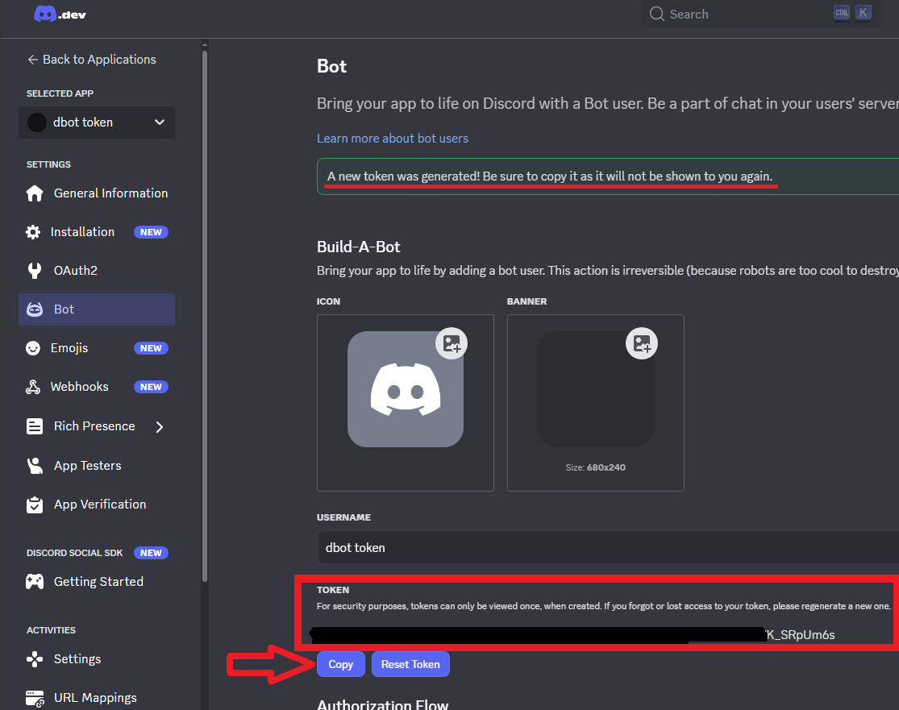

# 
Schritt-für-Schritt: Discord Bot Token bekommen

<h3>❗💡 Hinweis: Alle&nbsp;&nbsp;▶&nbsp;&nbsp;sind aufklappbar</h3>

---

### 1️⃣ Discord Developer Portal öffnen

👉 Gehe auf

[https://discord.com/developers/applications](https://discord.com/developers/applications)

Melde dich mit deinem **normalen Discord-Konto** an.

---

### 2️⃣ Neue Anwendung erstellen

Wenn du **noch keinen Bot hast**:

Klicke oben rechts auf **“New Application”**

<strong>Beispielbild</strong>

 

Gib einen Namen ein (z. B. *dbot token*) und klicke auf **Create**

<strong>Beispielbild</strong>

 

Wenn du **schon eine Anwendung** hast (z. B. für einen existierenden Bot):

→ Klicke einfach auf den Namen dieser Anwendung.

---

### 3️⃣ In den „Bot“-Bereich wechseln

Links in der Seitenleiste klickst du auf **Bot**

<strong>Beispielbild</strong>

 

Jetzt siehst du die Bot-Einstellungen deiner Anwendung.

---

### 4️⃣ Bot erstellen (falls nötig)

Falls du noch keinen Bot erstellt hast:

Klicke auf **“Add Bot”** und Bestätige es.

<strong>Beispielbild</strong>

 

Danach existiert dein Bot-Account.

---

### 5️⃣ Bot-Token anzeigen

Unter dem Abschnitt **Token:**

Klicke auf **“Reset Token”** oder **“View Token”** und bestätige mit **Yes, do it!**.

<strong>Beispielbild</strong>

 

<strong>Beispielbild</strong>

 

Kopiere das Token (z. B. `MTAxMjM0NTY3ODkw.Qwerty123ABC...`)

<strong>Beispielbild</strong>

 

⚠️ **Wichtig:**

Dieses Token ist **wie ein Passwort** für deinen Bot. Wenn du es jemandem gibst, kann er deinen Bot komplett steuern.  
→ Speichere es sicher (z. B. Passwortmanager).

---

### 6️⃣ Berechtigungen / Rechte (optional)

Wenn du den Bot auf einen Server holen willst:

- Gehe links auf **OAuth2 → URL Generator**
- Wähle:

  - **bot**
  - **applications.commands**

- Dann unten **Bot Permissions** auswählen (z. B. `Send Messages`, `Read Messages`)
- Kopiere die generierte URL und öffne sie → lade den Bot auf deinen Server ein.

---

Jetzt hast du das Token ✅

Name: dbot token 
Value: MTAxMjM0NTY3ODkw.Qwerty123ABC...

💡 Klicke nun direkt unten auf **Weiter** und beginne direkt mit deiner **Jentic Registrierung** und füge dabei dein Discord Token ein.

---

<a href="/docs/04-tools/04-windsurf/01-ueberblick/02-api_anbindungen_und_externe_modelle/README.md"><strong>Zurück</strong></a> | 
<a href="/docs/04-tools/04-windsurf/01-ueberblick/02-api_anbindungen_und_externe_modelle/02-jentic/README.md"><strong>Weiter</strong></a>

<a href="/docs/04-tools/04-windsurf/README.md/#dieses-thema-beinhaltet-folgende-kapitel"><strong>Zurück zur Kapitel-Übersicht</strong></a> | <a href="/docs/00-willkommen/README.md"><strong>Zurück zur Startseite des Wikis</strong></a>

