# 
Jentic Konfiguration - Anleitung

<h3>❗💡 Hinweis: Alle&nbsp;&nbsp;▶&nbsp;&nbsp;sind aufklappbar</h3>

✅ Wenn du der Einrichtung der API-Anbindung gefolgt bist solltest du an dieser Stelle bereits Python, Windsurf und uv/uvx installiert haben, sowie ein Discord Bot Token erstellt haben.

Jetzt führen wir dich durch die Jentic Registrierung, geben den Discord Bot Token ein und konfigurieren so einen **JENTIC_AGENT_API_KEY**.

Folge uns auf die Internetseite von <a href="https://jentic.com/">Jentic</a> und registriere dich kostenlos über den Button **Get Started**.

Bildbeispiel

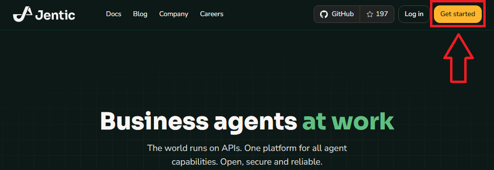

 

Gib deine Daten ein und klicke auf **Create Account** oder melde dich alternativ mit einem vorhanden Google-Konto an.

Bildbeispiel

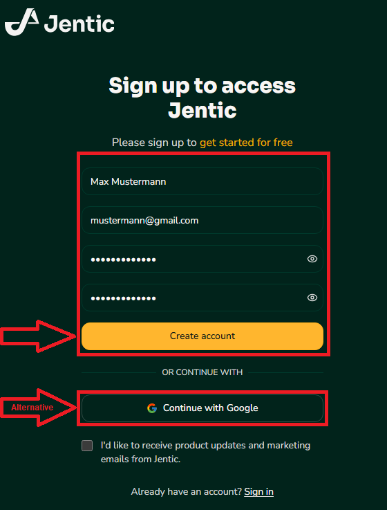

 

Du erhälst einen Verifizierungs-Mail an deine E-Mail Adresse. Gib den Code ein und klicke auf **Verify Email**.

Bildbeispiel

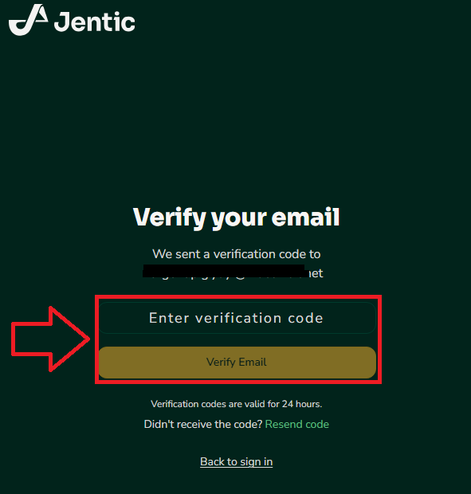

 

💡 Nach der Verifizierung musst du dich eventuell neu anmelden.

Richte zunächst die API ein. Klicke dafür im linken Menü auf **APIs** und dann rechts auf **Add API**.

Bildbeispiel

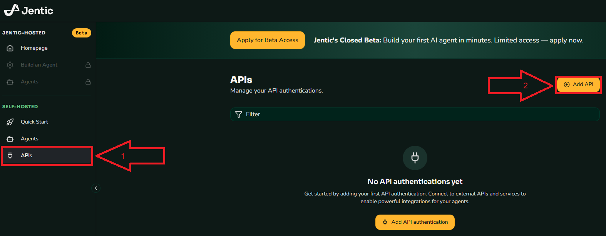

 

Wähle in der Liste **Discord** aus.

Bildbeispiel

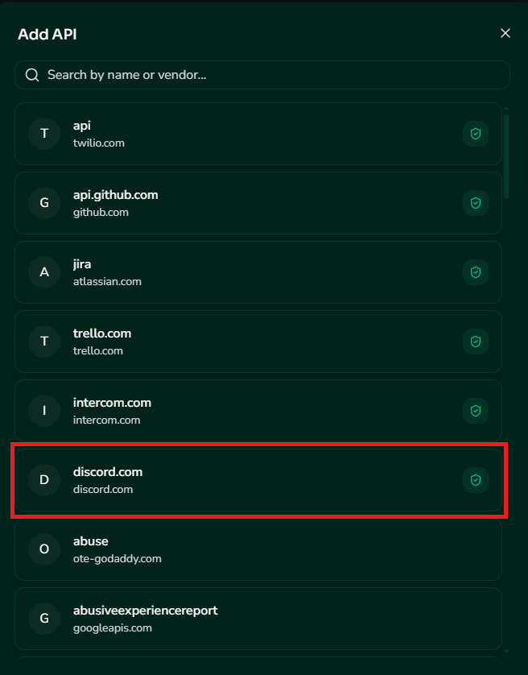

 

Kontrolliere ob dir in der oberen Zeile discord.com angezeigt wird. Wähle einen **Display Namen** (z.B. Discord bot token oder dbot token ) aus. Optional kannst du eine Beschreibung hinzufügen.

Entscheide dich für eine Authentifizierungsmethode. In unserem Beispiel wählen wir **API Key** aus.

Bildbeispiel

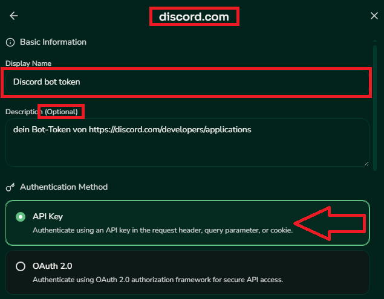

 

Gib als nächstes den API Key ein, den wir mit der <a href="/docs/04-tools/04-windsurf/01-ueberblick/01-api_anbindungen_und_externe_modelle/01-discord_token/README.md"><strong>Discord Token Anleitung</strong></a> erstellt haben und klicke unten auf Connect.

Bildbeispiel

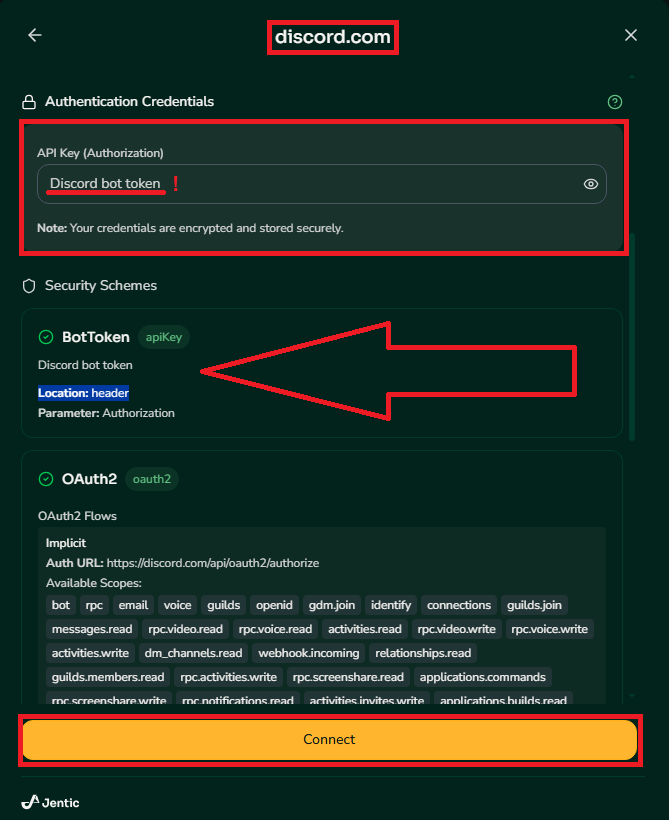

 

Dein neues Token ist nun eingerichtet und sollte in der Liste angezeigt werden.

Bildbeispiel

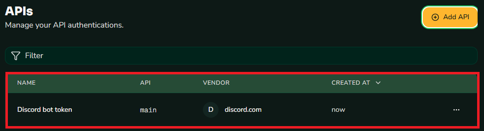

 

Als nächstes kümmern wir uns um den Agent. Klicke dafür im linken Menü auf **Agents** und dann rechts auf **Add Agent**.

Bildbeispiel

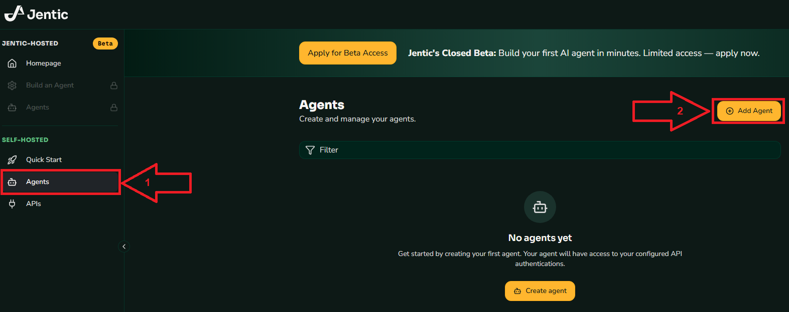

 

Gib einen Namen für deinen Agent ein (z.B. Discord Agent oder Mein Agent ) wähle den Discord bot token aus und klicke auf **Create Agent**.

Bildbeispiel

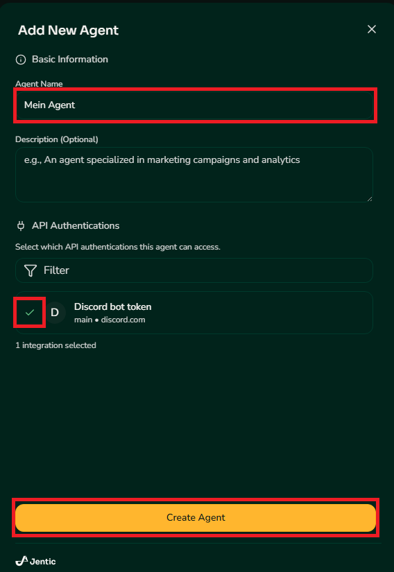

 

Du hast erfolgreich deinen Agent erstellt. Dein **JENTIC_AGENT_API_KEY** ist nun sichtbar und lässt sich direkt kopieren für die nächsten Schritte.

Bildbeispiel

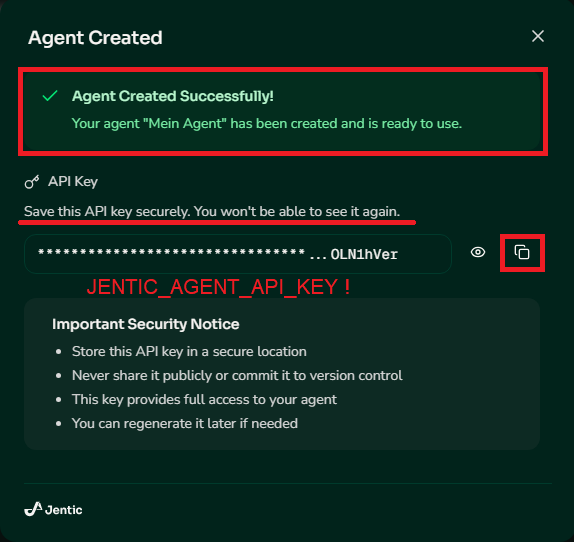

 

Du kannst die Jentic Registrierung jetzt verlassen. Wechsel anschließend direkt nach **PowerShell** und füge den **JENTIC_AGENT_API_KEY** nach folgendem Beispiel ein:

Bildbeispiel

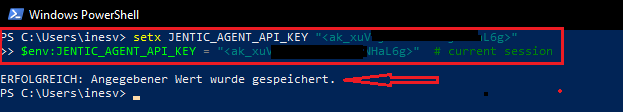

 

Hiermit ist die Jentic Konfiguration abgeschlossen.

⚠️ Bewahre deinen JENTIC_AGENT_API_KEY sicher auf. Dieser Schlüssel gewährt direkten Zugriff auf deine API-Workflows und sollte niemals öffentlich geteilt werden.

---

<a href="/docs/04-tools/04-windsurf/01-ueberblick/02-api_anbindungen_und_externe_modelle/01-discord_token/README.md"><strong>Zurück</strong></a> | <a href="/docs/04-tools/04-windsurf/01-ueberblick/03-workflows_und_automatisierungsprozesse/README.md"><strong>Weiter</strong></a>

<a href="/docs/04-tools/04-windsurf/README.md/#dieses-thema-beinhaltet-folgende-kapitel"><strong>Zurück zur Kapitel-Übersicht</strong></a> | <a href="/docs/00-willkommen/README.md"><strong>Zurück zur Startseite des Wikis</strong></a>

