# 
API-Anbindungen und externe Modelle in Windsurf konfigurieren

<h3>❗💡 Hinweis: Alle&nbsp;&nbsp;▶&nbsp;&nbsp;sind aufklappbar</h3>

## Einleitung

In modernen agentenbasierten Entwicklungsumgebungen wie Windsurf gewinnen die Integration von externen APIs und KI-Modellen rapide an Bedeutung. Die nahtlose Anbindung ermöglicht es, Workflow-Automatisierung, Informationsabruf aus Drittsystemen und intelligente Zusatzfunktionen zentral im Entwicklungsprozess bereitzustellen. 

Dieser Abschnitt erläutert dir die Einrichtung von API-Anbindungen — insbesondere der Jentic MCP-Integration — und die Nutzung externer Software (z.B Discord, OpenAI, GitHub usw.) innerhalb von Windsurf. Windsurf fungiert dabei als MCP-Client und kommuniziert mit Servern wie Jentic oder GitHub über Konfigurationsdateien und API-Schlüssel.

---

## 📖 Vorwissen

Bevor du beginnst, klären wir vorab die wichtigsten Begrifflichkeiten, die du vorab gehört haben solltest, um die Konfiguration der API-Anbindungen in Windsurf zu verstehen.

**API-Anbindungen (Application Programming Interface):**

APIs sind Schnittstellen, die es verschiedenen Softwareteilen ermöglichen, miteinander zu kommunizieren. Im Windsurf-Kontext dienen API-Anbindungen in Verbindung mit MCP-Servern dazu, die KI-Agenten (wie Cascade) mit den Funktionen oder Daten deines eigenen Codes oder externer Dienste zu verknüpfen. Zum Beispiel kann die KI mithilfe eines konfigurierten MCP-Servers und einer API-Anbindung auf deine Datenbank zugreifen, um eine Aufgabe zu lösen.

**MCP-Server (Model-Client-Protocol Server):** 

MCP ist ein offenes Protokoll, das es KI-Modellen (wie denen in Windsurf) ermöglicht, mit externen Datenquellen und Diensten zu kommunizieren und zu interagieren. Ein MCP-Server fungiert als Brücke. Er ermöglicht der KI, Echtzeitdaten abzurufen oder Aktionen in der realen Welt (über APIs) durchzuführen, was über ihr reines Trainingswissen hinausgeht.

**Docker:**

Docker ist eine Technologie für die Containerisierung von Anwendungen. Das bedeutet, es verpackt eine Anwendung mitsamt all ihren Abhängigkeiten (Bibliotheken, Konfigurationen etc.) in einen isolierten Container. Im Zusammenhang mit Windsurf ermöglicht die Docker-Integration Entwicklern, Container direkt aus der IDE heraus zu erstellen, zu verwalten und bereitzustellen. Dies sorgt für konsistente Entwicklungsumgebungen und erleichtert das Debugging von Anwendungen, die in Containern laufen.

**Jentic:**

Jentic ist eine Plattform, die es ermöglicht, APIs und Workflows für KI-Agenten zugänglich zu machen – oft durch die Verwendung des MCP-Protokolls. Der Jentic MCP Plugin für Windsurf liefert der IDE Tools, um APIs und Workflows in natürlicher Sprache zu suchen, Details zu laden und auszuführen (z.B. /search_apis, /execute). Dies erweitert die Fähigkeiten der Windsurf-KI, indem sie über Jentic auf eine breite Palette von externen Diensten zugreifen kann.

**Discord-Token:**

Ein Discord-Token ist ein geheimer Schlüssel, der zur Authentifizierung eines Discord-Bots oder eines Benutzerkontos bei der Discord-API verwendet wird. Im Kontext von Windsurf und den genannten Themen (insbesondere MCP/Jentic) ist das Discord-Token ein Beispiel für einen API-Schlüssel oder ein Geheimnis (Secret), das benötigt wird, wenn man eine API-Anbindung nutzen möchte, um mit Discord zu interagieren. Wenn du beispielsweise über Jentic einen API-Workflow in Windsurf ausführst, um eine Discord-Nachricht zu senden, musst du dieses Token sicher in den Anmeldeinformationen des MCP-Servers (z.B. in Jentic) hinterlegen.

---

## 📚 Schritt 1: Voraussetzungen und Vorbereitung

Nun stellen wir sicher, dass folgende grundlegende Komponenten installiert und eingerichtet sind:

- Python ≥ Version 3.11: Erforderlich für die Ausführung des MCP-Servers (uv/uvx).

<a href="https://www.python.org/downloads/">Python herunterladen</a>
 

- Windsurf: Die AI-gestützte IDE, in der alle weiteren Komponenten betrieben werden.

<a href="https://www.windsurf.com/download/">Windsurf herunterladen</a>
 

<a href="/docs/04-tools/04-windsurf/01-ueberblick/01-installation/README.md">Windsurf installieren</a>
 

- uv/uvx Launcher: Ermöglicht das Starten und Steuern von MCP-Servern, insbesondere für Jentic. 

<strong>Installieren mit pip über z.B. PowerShell (alle Betriebssysteme): pip install uv</strong>
 

Beispielbild

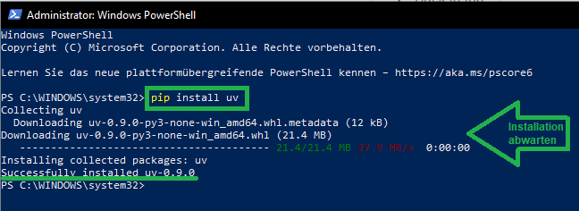

 

- Übungsbeispiel Discord Bot Token erstellen: 

<a href="/docs/04-tools/04-windsurf/01-ueberblick/02-api_anbindungen_und_externe_modelle/01-discord_token/README.md">🔗 Discord Bot Token erstellen</a>
 

- Jentic Registrierung durchführen und Discord Bot Token eingeben:

<a href="/docs/04-tools/04-windsurf/01-ueberblick/02-api_anbindungen_und_externe_modelle/02-jentic/README.md">🔗 Jentic Registrierung</a>
 

---

#### Docker Desktop installieren

1. Lade **Docker Desktop** für Windows herunter:

   👉 [https://www.docker.com/products/docker-desktop/](https://www.docker.com/products/docker-desktop/)

2. **Installiere Docker Desktop**

   - Wähle bei der Installation **"Windows (AMD64)"** aus (💡 Hinweis: Hiermit ist nicht gemeint, dass du eine AMD CPU haben musst)
   - Folge dem Setup-Assistenten

3. **Starte Docker Desktop**
 
   - Nach dem Start sollte unten rechts in der Taskleiste das Docker-Symbol sichtbar sein  
   - Prüfe, ob die Meldung **"Docker Desktop is running"** angezeigt wird

4. **Starte Windsurf neu**, falls es noch geöffnet war.  
   - Danach sollte der MCP-Server automatisch erfolgreich verbunden werden. Erkennbar durch einen grünen Punkt bei MCPs oben rechts im Cascade Chat Bereich.

5. **Github-MCP-Server in Docker Desktop hinzufügen**

   - Öffne Docker Desktop
   - Klicke auf den Button **Add Server** im Bereich MCP Toolkit.
   - Suche nach **GitHub** und wähle den offiziellen **GitHub-MCP-Server** aus der Liste
   - In einem Pop-up-Fenster wirst du aufgefordert, dein **GitHub-Token** einzugeben.  
     Füge dort das eben erstellte Token ein.
   - Bestätige deine Eingabe.

### ❗ Wichtiger Hinweis: Docker ist erforderlich!

Der Mein-MCP-Server wird in einer isolierten Umgebung über **Docker Desktop** ausgeführt.  
Wenn Docker **nicht installiert oder nicht gestartet** ist, erhältst du beim Start des Servers eine Fehlermeldung wie:

> MCP Server Error (mein-mcp-server): failed to create mcp stdio client: failed to start stdio transport: 
> failed to start command: exec: "docker": executable file not found in %PATH%

In diesem Fall überprüfe die bisherigen Schritte oder ob Docker Desktop gestartet ist.

---

## 🔧 Schritt 2: Mein-MCP-Server für GitHub über die Windsurf-Oberfläche installieren

In diesem Beispiel richten wir den Zugriff auf den **GitHub-MCP-Server** ein und schaffen eine Verbindung zwischen Windsurf und deinem GitHub-Konto.

Neben der manuellen Bearbeitung einer Konfigurationsdatei wie z.B. [MeinName_config.json] bietet Windsurf eine deutlich einfachere Möglichkeit, MCP-Server direkt über die grafische Oberfläche zu installieren.

💡 **Wichtiger Tipp:** Idealerweise nennst du deine Konfigurationsdatei nach deinem MCP-Server, z. B. MeinGitHubProjekt-MCP-Server.json und stellst sie auf **Schreibgeschützt**.

---

### 🧩 Ziel dieses Schrittes

Du verbindest Windsurf mit GitHub, damit du später z. B. Repositories durchsuchen, Issues erstellen, Pull Requests verwalten oder direkt aus der IDE mit Code arbeiten kannst, ohne GitHub separat öffnen zu müssen.

Diese Integration läuft über jenes **Model Context Protocol (MCP)** – Windsurf kommuniziert erst dadurch standardisiert mit GitHub über einen eigenen MCP-Server.

---

## 🔐 GitHub Token (Personal Access Token) erstellen

Damit Windsurf über den MCP-Server mit deinem GitHub-Konto kommunizieren darf, wird das sogenannte **Personal Access Token (PAT)** benötigt. Diesmal eben von Github anstelle von Discord.

> ⚠️ **Wichtig:** Behandle dein Token wie ein Passwort! Teile es **niemals** öffentlich oder in Code-Dateien, die du hochlädst.

---

### Schritt-für-Schritt-Anleitung zum Erstellen des GitHub Tokens

1. Melde dich bei GitHub an:  
   
   Öffne [https://github.com](https://github.com) und logge dich mit deinem Konto ein und verifiziere es anhand des Codes, der dir per E-Mail zugeschickt wird.

2. Öffne die Token-Verwaltung:  
   
   Klicke oben rechts auf dein

<strong>Profilbild</strong> ⏬ Beispielbild

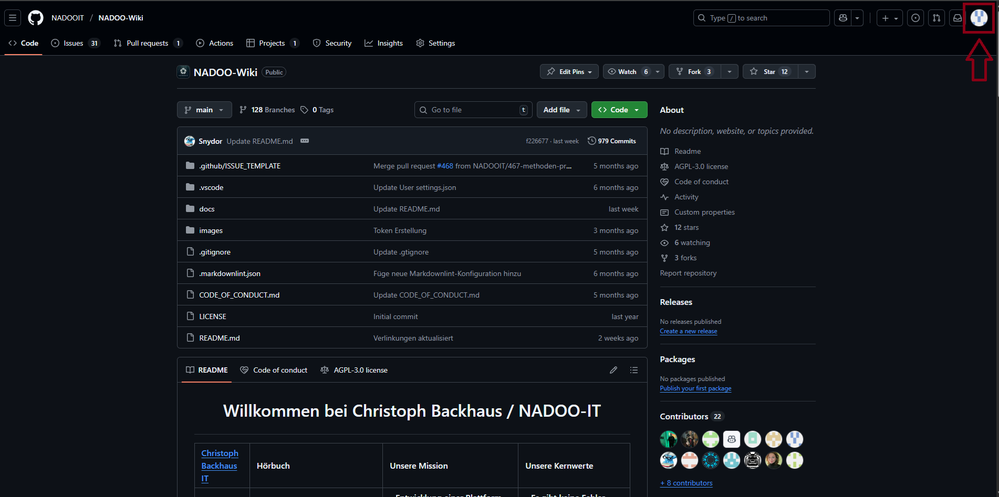

 

<strong>Settings</strong> ⏬ Beispielbild

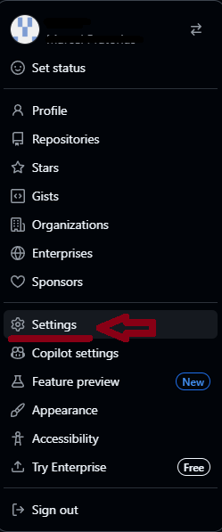

 

<strong>Developer settings</strong> ⏬ Beispielbild

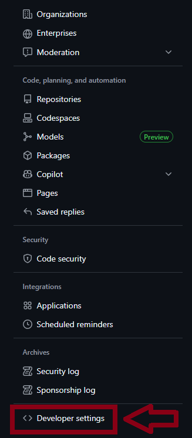

 

<strong>Personal access tokens → Tokens (classic)</strong> ⏬ Beispielbild

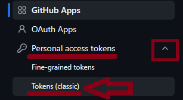

 

3. Klicke auf „Generate new token (classic)“.

Beispielbild

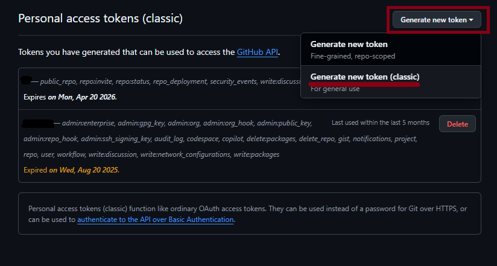

 

4. Vergib einen Namen (Note):  
   
   Wähle z. B. `WindsurfApiBeispiel` als Bezeichnung.

5. Lege eine Ablaufzeit (Expiration) fest:

   - Empfohlen: **90 Tage** (du kannst später ein neues Token erstellen)  
   - Alternativ: „No expiration“ für dauerhafte Nutzung

6. Aktiviere die erforderlichen Berechtigungen (Scopes):

   | Bereich | Beschreibung |
   |----------|--------------|
   | `repo` | Zugriff auf private und öffentliche Repositories |
   | `read:org` | Lesen von Organisationsdaten |
   | `workflow` | Zugriff auf GitHub Actions Workflows (optional, für CI/CD) |
   | `read:user` | Lesen von Benutzerinformationen |
   | `user:email` | Zugriff auf E-Mail-Adresse (optional) |

Beispielbild

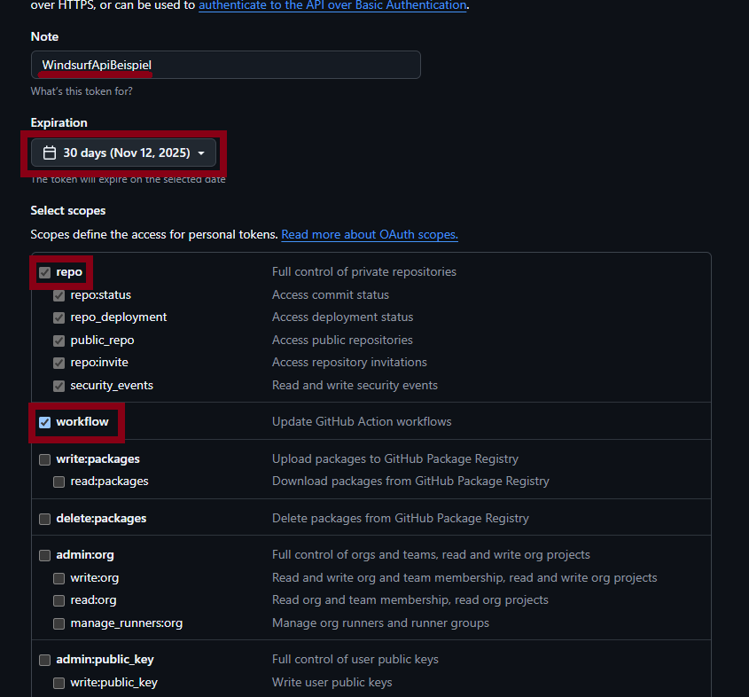

 

7. Erstelle das Token:

Klicke unten auf **Generate token**.

❗ Achtung, GitHub zeigt dir dein neues Token **nur ein einziges Mal** an.

Beispielbild

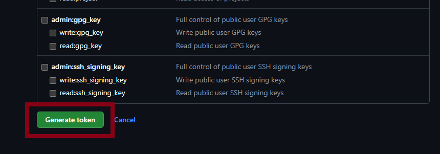

 

8. Kopiere das Token sofort und **bewahre es sicher auf** (z. B. in einem Passwortmanager oder einem verschlüsselten Notizsystem).

Beispielbild

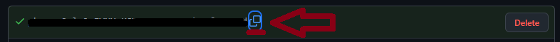

 

---

### 📥 Verwendung des Tokens in Windsurf

Nachdem du dein Token erstellt hast, kannst du es direkt in Windsurf verwenden:

1. **Öffne Windsurf.**

2. Suche in der rechten Seitenleiste das kleine Steckersymbol **(MCPs)** und klicke danach auf **MCP Marketplace**. 

Beispielbilder

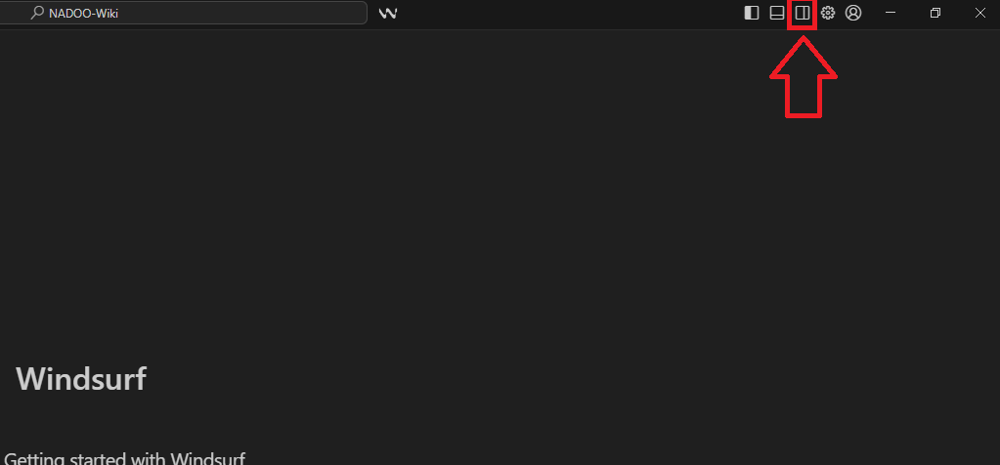

 

Beispielbilder

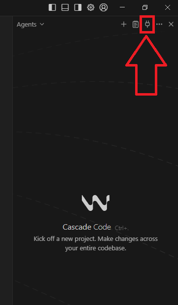

 

Beispielbilder

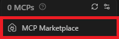

 

3. Wähle **GitHub** aus der Serverliste.    

Beispielbild

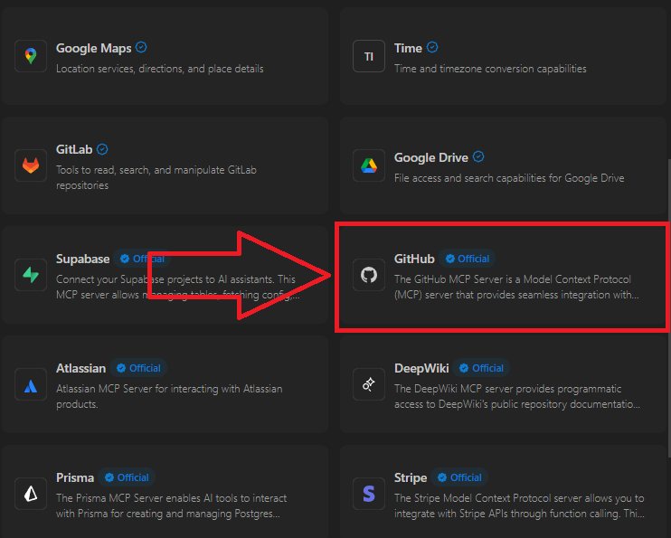

 

4. Klicke auf den Button **Install**. 

Beispielbild

 

5. In einem Pop-up-Fenster wirst du aufgefordert, dein **GitHub-Token** einzugeben.

   Füge dort das eben erstellte Token ein.

6. Bestätige deine Eingabe mit **Save**. 

Beispielbild

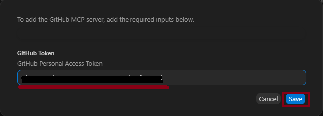

 

Nach der Bestätigung wird der **MCP-Server automatisch installiert** und mit deinem Konto verbunden.  
Der Button ändert sich anschließend zu **Enabled**, was bedeutet, dass der Server jetzt aktiv ist. 

❗ Solltest du aber **Disabled** angezeigt bekommen, hast du wahrscheinlich noch kein Docker Desktop installiert.

---

### 🧠 Was der GitHub-MCP-Server macht

Sobald die Verbindung aktiv ist, kann Windsurf über den GitHub-MCP-Server folgende Aktionen durchführen:

| Funktion | Beschreibung |
|-----------|---------------|
| 🔍 **Repository-Abfragen** | Durchsuche deine GitHub-Repositories oder öffentliche Projekte direkt aus Windsurf. |
| 🧾 **Issue-Verwaltung** | Erstelle, bearbeite und kommentiere Issues über die Befehlszeile oder UI. |
| 🆙 **Pull Requests** | Öffne, vergleiche oder mergen PRs direkt aus der IDE. |
| 🧠 **Kontextuelle Analyse** | Kombiniere KI-Modelle mit GitHub-Daten, z. B. Codevorschläge basierend auf Repository-Inhalten. |
| 🔑 **Authentifizierung über Token** | Die Authentifizierung erfolgt sicher über dein GitHub-Personal-Access-Token (PAT). |

---

### ✅ Abschluss dieses Schrittes

Wenn der Mein-MCP-Server in Windsurf unter **Aktive Server** angezeigt wird und der Status auf **Grün** steht, ist die API-Anbindung erfolgreich eingerichtet.  

💡 Wichtiger Tipp: Lasse Docker beim Arbeiten mit Windsurf dauerhaft im Hintergrund laufen, damit verbundene Server automatisch aktiv bleiben.

---

## 📋 Schritt 3: Übersicht – weitere API-Integrationen in Windsurf

Nachdem du erfolgreich den Mein-MCP-Server über die Windsurf-Oberfläche installiert hast, kannst du auf ähnliche Weise auch andere APIs oder externe Modelle anbinden. Windsurf unterstützt eine Vielzahl von Schnittstellen, die über das **Model Context Protocol (MCP)** verwaltet werden.

Diese MCP-Server dienen als **Brücke zwischen der IDE und externen Diensten**, damit Windsurf direkt mit Tools, Datenquellen oder KI-Modellen kommunizieren kann.

Beispiele für unterstützte APIs und Integrationen:

| Dienst / API | Beschreibung | Typische Verwendung |
|---------------|--------------|----------------------|
| **GitHub MCP** | Zugriff auf Repositories, Pull Requests, Issues | Codeverwaltung, Projektautomation |
| **Discord MCP** | Verbindung zu Discord-Bots und Kanälen | Chat-Befehle, Benachrichtigungen |
| **OpenAI MCP** | Nutzung von GPT-Modellen in Windsurf | KI-gestützte Codevorschläge, Textanalysen |
| **Notion MCP** | Zugriff auf Notion-Datenbanken | Dokumentation, Aufgabenverwaltung |
| **Google Drive MCP** | Zugriff auf Dateien und Ordner | Datenimport, automatisierte Berichte |
| **Launchpad Voice MCP** | Zugriff auf Voice-Modellen | Sprachverarbeitung, Text-to-Speech |
| **Launchpad Kalender MCP** | Zugriff auf Kalender-Datenbanken, Dokumentation | Kundentermine und Veranstaltungen.

💡 **Tipp:**

Du kannst MCP-Server auch manuell installieren, indem du die Konfigurationsdatei (z.B. `mcp_config.json`) bearbeitest. 

Fülle deine Config-Datei mit folgenden Informationen aus:

Bildbeispiel

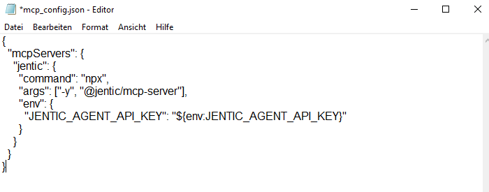

 

Wenn du es nicht bereits in der Jentic Konfiguration gemacht hast, wechsel anschließend nach Powershell und führe dort folgende Befehle aus:

Bildbeispiel

 

🌐 Genauere Informationen zur manuellen Installation von MCP-Servern findet man im Internet reichlich.

Einige Server (z. B. OpenAI oder Discord) benötigen zudem zusätzlich lokale Python- oder Docker-Komponenten, die Windsurf bei Bedarf anfordert oder automatisch installiert.

---

## 🖇 Schritt 4: APIs und externe Modelle mit MCP-Servern verknüpfen

Nachdem du deine gewünschten MCP-Server (z. B. GitHub, Jentic oder Discord) erfolgreich eingerichtet hast, kannst du sie nun aktiv in Windsurf verwenden.

Das Herzstück der Kommunikation ist das **Model Context Protocol (MCP)**.  
Ein MCP-Client wie *Cascade*, der innerhalb von Windsurf läuft, verbindet sich mit den konfigurierten Servern und übernimmt dabei:

- die Kommunikation zwischen IDE und API,
- die Authentifizierung (z. B. per Token),
- sowie die Steuerung von Zugriffen und Workflows.

Wenn du – wie in Schritt 2 beschrieben – den GitHub-MCP-Server eingerichtet hast, kannst du damit direkt auf GitHub-Daten zugreifen, ohne Windsurf zu verlassen.

**Beispielhafte Aktionen:**

- Repository-Informationen abrufen  
- Offene Pull Requests oder Issues anzeigen  
- Neue Issues oder Branches anlegen  
- Automatisierte Kommentare über Workflows schreiben

‼️ **Wichtiger Hinweis:**

<strong>Denk daran, dass das Repository des offiziellen GitHub-Servers nicht von dir als Testumgebung verwendet werden sollte. Verwende stattdessen unsere NADOO-Repositorys – hier kannst du z. B. im Wiki-Repository sinnvolle Issues zu echten Problemen anlegen und vieles mehr.</strong>

---

## Schritt 5: Troubleshooting & häufige Fehler

Auch bei korrekter Konfiguration kann es bei der API-Anbindung in Windsurf gelegentlich zu Fehlermeldungen oder Verbindungsproblemen kommen. In diesem Abschnitt lernst du, wie du typische Fehler erkennst, behebst und dauerhaft vermeidest.

---

## 🧩 Allgemeine Problemquellen

| Kategorie | Beschreibung | Lösung |
|------------|--------------|--------|
| **1. Docker nicht gestartet** | Windsurf kann keine MCP-Server starten, wenn Docker Desktop nicht läuft. | Öffne **Docker Desktop**, warte bis „Docker is running“ erscheint, und starte Windsurf anschließend neu. |
| **2. Fehlendes Token** | Windsurf zeigt bei GitHub, Discord oder Jentic einen Authentifizierungsfehler an. | Prüfe, ob dein Token in Windsurf korrekt eingetragen ist. Falls du dein Token in GitHub oder Jentic neu generiert hast, musst du es auch in Windsurf aktualisieren. |
| **3. Falsches Format in der JSON-Datei** | Die manuell erstellte `mcp_config.json` wurde fehlerhaft formatiert oder enthält ungültige Schlüssel. | Öffne die Datei erneut und prüfe sie auf fehlende Kommata, falsche Klammern oder Tippfehler. |
| **4. Pfadprobleme (uv/uvx)** | Windows erkennt den MCP-Launcher nicht. | Prüfe über **PowerShell** mit `where.exe uv`, ob der Pfad korrekt gesetzt ist. Ggf. `pip install uv` erneut ausführen. |
| **5. Netzwerk oder Firewall blockiert Zugriff** | Windsurf kann keine Verbindung zu externen APIs aufbauen. | Deaktiviere testweise lokale Firewalls oder trage Windsurf in die Liste der zugelassenen Programme ein. |
| **6. Server startet, aber bleibt inaktiv** | Windsurf zeigt „Server inactive“ oder „Client not responding“. | Beende Windsurf, starte Docker Desktop neu und öffne Windsurf anschließend erneut. |
| **7. API-Fehlercodes (401 / 403)** | Authentifizierungsfehler, Token ungültig oder abgelaufen. | Erstelle ein neues Token (z. B. in GitHub oder Jentic) und trage es erneut ein. |
| **8. Fehlende Berechtigungen im Token** | Token besitzt nicht die benötigten Rechte. | Erstelle in GitHub ein **Personal Access Token (Classic)** mit den Scopes `repo`, `read:user` und `workflow`. |

---

## ⚙️ Fehleranalyse in Windsurf

Windsurf bietet mehrere Wege, Logs und Fehlerquellen zu prüfen:

1. **Fehlermeldungen im unteren Fensterbereich („Output“) prüfen**

   - Hier werden Startfehler, Tokenprobleme und API-Antworten protokolliert.  

2. **Docker-Logs überprüfen**

   - Öffne Docker Desktop  
   - Klicke auf den Container deines MCP-Servers  
   - Unter „Logs“ findest du Hinweise auf Startprobleme oder fehlende Umgebungsvariablen.  

3. **PowerShell verwenden**

   Wenn Windsurf nicht reagiert, kannst du den MCP-Server auch manuell starten:  
   
   - docker ps
   - docker logs <containername>

---

## Zusammenfassung

Windsurf bietet durch direkte Integration von MCP-Servern eine hochmoderne Plattform zur einfachen, deklarativen Anbindung an APIs und externe Modelle. Die flexible Nutzung der mcp_config.json, UI-gestützte Verwaltung und YAML-basierte Workflows ermöglicht es, praktisch jede gewünschte Datenquelle oder Modellfunktion in den eigenen Entwicklungsprozess zu bringen — bei höchstem Komfort und voller Kontrolle über Authentifizierung, Berechtigungen und Ausführung.

<a href="/docs/04-tools/04-windsurf/01-ueberblick/01-installation/README.md"><strong>Zurück</strong></a> | 
<a href=/docs/04-tools/04-windsurf/01-ueberblick/02-api_anbindungen_und_externe_modelle/01-discord_token/README.md><strong>Weiter</strong></a>

<a href="/docs/04-tools/04-windsurf/README.md/#dieses-thema-beinhaltet-folgende-kapitel"><strong>Zurück zur Kapitel-Übersicht</strong></a> | <a href="/docs/00-willkommen/README.md"><strong>Zurück zur Startseite des Wikis</strong></a>

