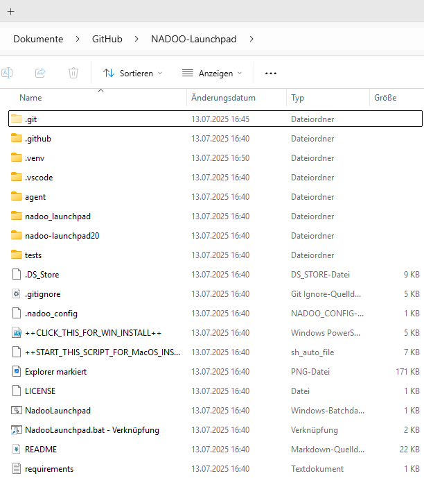
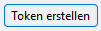
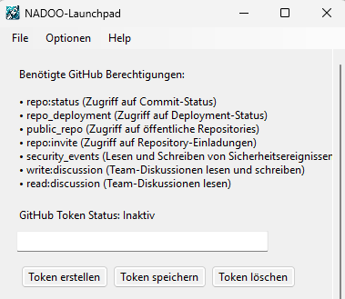
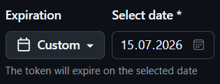
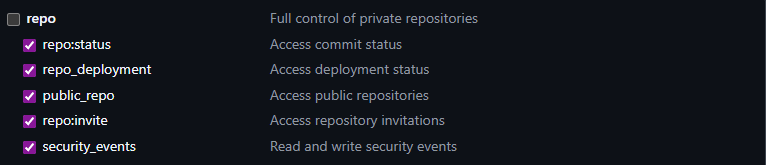
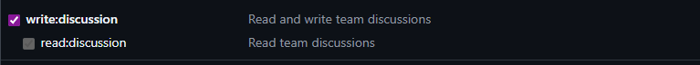
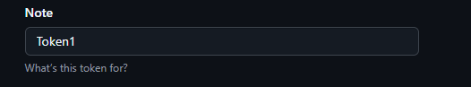
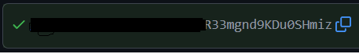
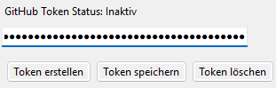

# 
[Feature-Guide]: Tokens

<!-- Erklärung zu / Anwendung von:

Github Token Status + Eingabefeld | Token erstellen / speichern / löschen  -->

---
<h1 align=center>Token erstellen</h1>

<h2>1. Öffne das Launchpad</h2>

Navigiere zu folgendem Pfad (in der Regel):

<h2>2. Klicke auf „Token erstellen“ → </h2>

<h2>3. Wähle das Enddatum deines Praktikums aus.</h2>
<b>Beispiel:</b> 

<h2>4. Wähle alle Berechtigungen aus der Abbildung aus:</h2>
<strong>Hier eine Auflistung:</strong> 
(auch erkennbar in <b>"Punkt 2: Benötigte GitHub-Berechtigungen"</b>) 
 
<strong>Außerdem auch:</strong> 
(Bitte <strong>zuerst read:discussion</strong> und <strong>dann</strong> <b>erst</b> <strong>write:discussion auswählen!</strong> Bei <b>read:discussion verschwindet</b> dann das <b>Häkchen</b>)

<h2>5. Trage einen aussagekräftigen Namen in das Feld „Node“ ein, der den Token beschreibt.</h2>

<h2>6. Kopiere den erzeugten Schlüssel.</h2>

<h2>7. Füge den Schlüssel in das entsprechende Feld im Launchpad ein</h2>
 
<strong>→ Speichern nicht vergessen!</strong>

  

---

**Dieses Thema beinhaltet folgende Kapitel:**
---

🔹 [**Menu**](/docs/04-tools/05-launchpad/01-ueberblick/01-windows/README.md)  
🔹 [**Berechtigungen**](/docs/04-tools/05-launchpad/01-ueberblick/02-mac/README.md)  
🔹 [**Tokens**](/docs/04-tools/05-launchpad/01-ueberblick/02-mac/README.md)  
🔹 [**Zeiterfassung**](/docs/04-tools/05-launchpad/01-ueberblick/02-mac/README.md)  
🔹 [**Projektverwaltung**](/docs/04-tools/05-launchpad/01-ueberblick/02-mac/README.md)  
🔹 [**Aktivitäten**](/docs/04-tools/05-launchpad/01-ueberblick/02-mac/README.md)  
🔹 [**WochenÜbersicht**](/docs/04-tools/05-launchpad/01-ueberblick/02-mac/README.md)  
🔹 [**Watchdog**](/docs/04-tools/05-launchpad/01-ueberblick/02-mac/README.md)  
🔹 [**Create Snippets**](/docs/04-tools/05-launchpad/01-ueberblick/02-mac/README.md)  
🔹 [**Function names**](/docs/04-tools/05-launchpad/01-ueberblick/02-mac/README.md)  
🔹 [**T-Bar senden**](/docs/04-tools/05-launchpad/01-ueberblick/02-mac/README.md)  

---

📅 <strong>Dieses Dokument wurde bearbeitet am:</strong> 19.09.2025
 
✍️ <strong>Von:</strong> <a href="https://github.com/johkori">Johkori(Tim H.)</a> (GitHub)

---

<a href="/docs/04-tools/05-launchpad/02-features/02-berechtigungen/README.md">
<strong>Zurück</strong></a> | <a href="/docs/04-tools/05-launchpad/02-features/04-zeiterfassung/README.md"><strong>Weiter</strong></a>

