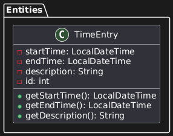

# Clean Architecture

Einführung in Clean Architecture am Beispiel einer Zeiterfassungsanwendung

## Schichten und ihre Aufgaben

### Entities (Enterprise Business Rules)

Diese Schicht 🟨 enthält die Domänenmodelle und Kern-Geschäftsregeln. Sie ist unabhängig von äußeren Details und definiert, wie zentrale Daten (z. B. Zeiteintrag) strukturiert und validiert werden.

### Use Cases (Application Business Rules)

Die Use Cases 🟥 orchestrieren den Datenfluss zwischen den Entitäten und steuern die Abläufe der Anwendung. Sie definieren, wie Entitäten interagieren und reagieren auf Eingaben, ohne konkrete technische Abhängigkeiten zu kennen.

### Interface Adapters

Hier vermitteln Controller, Presenter und Gateways 🟩 zwischen der Domäne und äußeren Systemen. Sie übersetzen Datenformate und rufen beispielsweise die Use-Case-Methoden auf, um Ergebnisse für UI oder Datenbank zugänglich zu machen.

### Frameworks & Drivers

Die äußerste Schicht integriert externe Infrastruktur (z. B. Datenbanken, UI oder Geräte) 🟦. Abhängigkeits-Pfeile zeigen stets von außen nach innen, sodass Frameworks die Kernlogik nicht beeinflussen.


---

Die Clean Architecture unterteilt eine Anwendung typischerweise in vier Schichten mit klar getrennten Verantwortlichkeiten:

- Entities (Entitäten) – Die Domänenmodelle mit den zentralen Geschäftsregeln und Datenstrukturen des Systems. Sie bilden die Kerngeschäftslogik und sind von allen anderen Details unabhängig. Diese Schicht ändert sich am seltensten und kann oft wiederverwendet werden.
- Use Cases (Anwendungsfälle) – Die anwendungsspezifische Geschäftslogik, welche die Abläufe für bestimmte Aktionen oder Szenarien definiert. Use Cases orchestrieren den Datenfluss zu und von den Entitäten und enthalten die Kernlogik, wie das System auf Eingaben reagiert.
- Interface Adapters (Schnittstellenadapter) – Diese Schicht enthält Adapter und Vermittler zwischen der Domäne und der Außenwelt. Sie implementiert die Schnittstellen der Use-Case-Schicht und übersetzt Daten zwischen inneren und äußeren Formaten. Typische Bestandteile sind Controller (für Eingaben, z. B. UI- oder API-Aufrufe), Presenter oder Output Boundary (für Ausgaben/Aufbereitung von Daten für die UI) und Gateways (für den Datenaustausch mit externen Systemen wie Datenbanken oder Web-Services).
- Frameworks & Drivers (Externe Rahmenwerke) – Die äußerste Schicht mit allen technischen Details und Infrastruktur-Komponenten. Dazu zählen z. B. Datenbanken, Web-Frameworks, UI-Frameworks oder externe APIs. Diese Schicht enthält konkrete Implementierungen, die über Adapter an die innen liegenden Schichten angebunden sind. Ziel ist es, dass Änderungen an solchen externen Technologien minimalen Einfluss auf den Anwendungskern haben.

Wichtig: Bei Clean Architecture hängt jede Schicht nur von innen liegenden Schichten ab, nie umgekehrt. Die innere Geschäftslogik kennt also keine Details der äußeren Schichten. Dieses Prinzip der Abhängigkeitsumkehr (Dependency Inversion) stellt sicher, dass die Domäne nicht von Frameworks oder Datenbanken beeinflusst wird.

---

## Praktisches Beispiel: Zeiterfassungsanwendung Schritt für Schritt

### Schritt 1: Projektstruktur einrichten

```plaintext
project-root/
├── entities/         # Kern-Domänenmodelle und Geschäftsregeln
├── usecases/         # Anwendungsspezifische Geschäftlogik
├── adapters/         # Schnittstellenadapter (Repositories, Controller, Presenter)
└── frameworks/       # Implementierungen der Infrastruktur (Datenbanken, UI, APIs)
```

- entities/ – enthält die Domänenmodelle (Entitäten) und grundlegende Geschäftslogik, z. B. eine Klasse TimeEntry für einen Zeiteintrag.
- usecases/ – enthält die Anwendungsfall-Logik, z. B. Klassen RecordTime und ListTimeEntries für „Zeit erfassen“ und „Zeiten anzeigen“.
- adapters/ – enthält die Schnittstellen-Adapter zwischen Kern und Außenwelt, z. B. Implementierungen eines TimeEntryRepository (Datenbankzugriff) sowie Controller/Presenter für UI oder API.
- frameworks/ – enthält die konkreten Framework- und Infrastruktur-Schichten, z. B. eine Datenbankkonfiguration, Webserver-Code oder eine CLI-Anwendung, die unsere Use Cases aufruft.

Diese Struktur trennt klar die Domäne (innen) von den technischen Details (außen). Als Nächstes füllen wir diese Schichten mit Inhalt.

### Schritt 2: Zentrale Use Cases definieren

- „Zeit erfassen“ – Ein Nutzer möchte eine neue Arbeitszeit erfassen. Dazu gibt er z. B. Startzeit, Endzeit und eine Beschreibung ein. Die Anwendung soll daraus einen Zeiteintrag erstellen und speichern.
- „Zeiten anzeigen“ – Der Nutzer möchte bereits erfasste Arbeitszeiten einsehen. Die Anwendung soll eine Liste der gespeicherten Zeiteinträge anzeigen (z. B. alle Einträge des Tages oder der Woche).


---

Die Use Cases sind die zentralen Anwendungsfälle, die unser System unterstützen soll. Sie definieren die Interaktionen zwischen dem Nutzer und dem System. In unserem Beispiel sind das „Zeit erfassen“ und „Zeiten anzeigen“. Diese Use Cases sind unabhängig von der konkreten Implementierung und beschreiben nur, was der Nutzer tun möchte und was das System zurückgeben soll.

Durch das klare Definieren dieser Use Cases wissen wir, welche Funktionen unser System bieten muss. Jeder Use Case wird in der Clean Architecture später durch eine eigene Interaktor-Klasse (Use-Case-Klasse) repräsentiert, die genau diese Aktion durchführt.


---

### Schritt 3: Entities implementieren

Nun erstellen wir die zentralen Entitäten der Domäne. In unserer Zeiterfassung ist die wichtigste Entität ein Zeiteintrag, den wir als Klasse TimeEntry umsetzen. Dieses Domänenobjekt hält die relevanten Daten eines Zeiteintrags und kann ggf. geschäftslogische Regeln kapseln (z. B. Validierung, dass die Endzeit nach der Startzeit liegt).

```java
// entities/TimeEntry.java
package entities;

import java.time.LocalDateTime;

public class TimeEntry {
    private LocalDateTime startTime;
    private LocalDateTime endTime;
    private String description;
    private int id;  // eindeutige ID des Eintrags (optional)

    public TimeEntry(LocalDateTime startTime, LocalDateTime endTime, String description) {
        if (endTime.isBefore(startTime)) {
            throw new IllegalArgumentException("Endzeit darf nicht vor der Startzeit liegen.");
        }
        this.startTime = startTime;
        this.endTime = endTime;
        this.description = description;
        // ID wird ggf. von der Datenbank oder Repository vergeben
    }

    // Getter/Setter und ggf. weitere Methoden, z.B. Dauer berechnen
    public LocalDateTime getStartTime() { return startTime; }
    public LocalDateTime getEndTime() { return endTime; }
    public String getDescription() { return description; }

    @Override
    public String toString() {
        return String.format("TimeEntry{id=%d, start=%s, end=%s, desc='%s'}",
                             id, startTime, endTime, description);
    }
}
```

Die TimeEntry-Klasse hält hier Start- und Endzeit sowie eine Beschreibung des Zeiteintrags. Eine optionale ID kann vom System vergeben werden (z. B. automatisch im Repository). In der Konstruktor-Logik könnten wir bereits Geschäftsregeln überprüfen (im Beispiel: die Endzeit darf nicht vor der Startzeit liegen). Weitere Domänenlogik ließe sich ebenfalls in Entities kapseln (z. B. Dauer eines Eintrags berechnen).



---

### Schritt 4: Use Cases umsetzen

Als Nächstes implementieren wir die Use Cases RecordTime (Zeit erfassen) und ListTimeEntries (Zeiten auflisten). Diese Use-Case-Klassen gehören zur Anwendungsschicht und enthalten die Ablauflogik für die definierten Szenarien. Wichtig: Die Use Cases sollen unabhängig von Details wie der Datenbank sein – sie arbeiten stattdessen mit Abstraktionen (Schnittstellen), um z. B. auf ein Repository zuzugreifen.

Wir definieren zunächst ein Repository-Interface, das von der Domäne aus gesehen die Datenhaltung repräsentiert (z. B. für Zeiteinträge speichern und laden). Dieses Interface wird im nächsten Schritt genauer erläutert. Die Use-Case-Klasse RecordTimeUseCase nutzt das Interface, um den neuen Eintrag zu persistieren:

```java
// usecases/RecordTimeUseCase.java
package usecases;

import entities.TimeEntry;
import java.time.LocalDateTime;

public class RecordTimeUseCase {
    private final TimeEntryRepository repository;

    public RecordTimeUseCase(TimeEntryRepository repository) {
        this.repository = repository;
    }

    /** Führt den Use Case "Zeit erfassen" aus */
    public TimeEntry execute(LocalDateTime start, LocalDateTime end, String description) {
        // 1. Neuen Zeiteintrag erstellen (Domänen-Entität)
        TimeEntry entry = new TimeEntry(start, end, description);
        // 2. Über das Repository speichern
        repository.save(entry);
        // 3. Ergebnis zurückgeben (oder an Output-Presenter schicken)
        return entry;
    }
}
```

---

Und analog dazu der Use Case zum Anzeigen der Zeiten:

```java
// usecases/ListTimeEntriesUseCase.java
package usecases;

import entities.TimeEntry;
import java.util.List;

public class ListTimeEntriesUseCase {
    private final TimeEntryRepository repository;

    public ListTimeEntriesUseCase(TimeEntryRepository repository) {
        this.repository = repository;
    }

    /** Führt den Use Case "Zeiten anzeigen" aus */
    public List<TimeEntry> execute() {
        // Holt alle gespeicherten Zeiteinträge über das Repository
        return repository.findAll();
    }
}
```

In RecordTimeUseCase sehen wir, dass der neue TimeEntry erstellt und dann über repository.save(...) gespeichert wird – ohne zu wissen, wie genau gespeichert wird. ListTimeEntriesUseCase ruft über das gleiche Repository-Interface die Liste aller Einträge ab. Die Geschäftslogik (hier trivial: Erstellen bzw. Laden von Einträgen) ist damit gekapselt. Beide Use Cases hängen nur von der Abstraktion TimeEntryRepository ab, nicht von einer konkreten Datenbank oder Liste.

Hinweis: In einer komplexeren Anwendung könnte RecordTimeUseCase statt eines direkten Rückgabewerts auch einen Output-Presenter aufrufen, um z. B. eine Bestätigung oder aufbereitete Daten an die UI weiterzugeben. Für unser einfaches Beispiel genügt es, den neuen Eintrag zurückzugeben.

---

### Schritt 5: Schnittstellen (Input, Output, Gateways) definieren

Bis jetzt haben wir im Code bereits angedeutet, welche Schnittstellen zwischen den Schichten nötig sind. In Clean Architecture sprechen wir oft von Ports und Gateways:

- Ein Input-Port definiert, wie ein Use Case von außen aufgerufen wird (z. B. die Methode execute(...) unseres Use-Case-Objekts). Man könnte hier auch ein Interface vorsehen, das der Use Case implementiert, um den Aufruf weiter zu abstrahieren. In unserem einfachen Beispiel genügt jedoch die öffentliche Methode der Use-Case-Klasse als Eingabeschnittstelle.
- Ein Output-Port definiert, wie der Use Case Ergebnisse an die äußere Schicht zurückliefert. Oft wird hierfür ein Presenter-Interface verwendet, das z. B. eine Methode presentTimeEntry(TimeEntry entry) bereitstellt. Unser RecordTimeUseCase gibt den Eintrag direkt zurück, was in einfachen Fällen ausreichen kann. Alternativ könnte er output.present(entry) aufrufen – die konkrete Präsentationslogik würde dann eine Implementierung des Output-Ports im äußeren Layer übernehmen.
- Gateways (auch Datenbank- oder API-Schnittstellen) abstrahieren den Zugriff auf externe Systeme. In unserem Fall dient TimeEntryRepository als Gateway zur Datenhaltung.

---

Wir definieren nun explizit das Repository-Interface für Zeiteinträge.

Dieses Interface gehört zur Domäne bzw. Anwendungslogik (inneren Schicht) und stellt die Methoden bereit, die wir zum Speichern und Laden von TimeEntry-Objekten brauchen. Damit wenden wir das Dependency-Inversion-Prinzip an: Die innere Schicht definiert den Vertrag, den die äußere Schicht erfüllen muss.

```java
// usecases/TimeEntryRepository.java  (Interface der Domäne)
package usecases;

import entities.TimeEntry;
import java.util.List;

public interface TimeEntryRepository {
    void save(TimeEntry entry);
    List<TimeEntry> findAll();
    // Optional: weitere Methoden, z.B. findById, delete etc.
}
```

---

Dieses Interface wird von den Use Cases verwendet, kennt aber keine Details der Implementierung. Die konkrete Speicherung (etwa in einer Datenbank oder in einer Liste) wird erst in der äußeren Schicht entschieden. Durch diese Schnittstelle bleibt unsere Geschäftslogik (Use Cases + Entities) komplett unabhängig von der Datenbank-Technologie.

Zusammengefasst erstellen wir also Schnittstellen für alle Stellen, an denen die innere Logik mit etwas Äußerem kommuniziert:

- Der Input-Port ist implizit die Signatur der Use-Case-Methoden (z. B. execute).
- Der Output-Port könnte ein Presenter-Interface sein (haben wir hier optional erwähnt).
- Das Gateway-Interface ist unser TimeEntryRepository für die Datenhaltung.

All diese Interfaces liegen innerhalb der Kernlogik und definieren Anforderungen, die außerhalb erfüllt werden. Damit „kennt“ die innere Schicht nur Abstraktionen, keine konkreten Klassen der äußeren Welt – ein zentrales Prinzip von Clean Architecture und SOLID (Dependency Inversion).

---

### Schritt 6: Adapter und äußere Schicht umsetzen

Im letzten Schritt kümmern wir uns um die Adapter in der äußeren Schicht, die unsere Use Cases in ein laufendes System einbinden. Wir betrachten zwei mögliche Ansätze:

1. Eine einfache Konsolenanwendung (CLI), die die Use Cases direkt aufruft.
2. Eine Web-API (REST), die HTTP-Anfragen annimmt und an die Use Cases weiterleitet.

Zur Veranschaulichung implementieren wir einen einfachen CLI-Adapter. Dabei nutzen wir ein In-Memory Repository (eine schnelle Implementierung von TimeEntryRepository, die die Daten in einer Liste hält) und rufen die Use Cases aus einer main-Methode heraus auf:

```java
// adapters/InMemoryTimeEntryRepository.java
package adapters;

import usecases.TimeEntryRepository;
import entities.TimeEntry;
import java.util.ArrayList;
import java.util.List;

public class InMemoryTimeEntryRepository implements TimeEntryRepository {
    private List<TimeEntry> storage = new ArrayList<>();

    @Override
    public void save(TimeEntry entry) {
        // einfache Speicherung in einer Liste
        // hier könnte auch eine ID vergeben werden, z.B. entry.setId(...)
        storage.add(entry);
    }

    @Override
    public List<TimeEntry> findAll() {
        return new ArrayList<>(storage);
    }
}
```

---

```java
// frameworks/TimeTrackerCLI.java
package frameworks;

import adapters.InMemoryTimeEntryRepository;
import usecases.RecordTimeUseCase;
import usecases.ListTimeEntriesUseCase;
import entities.TimeEntry;
import java.time.LocalDateTime;
import java.util.List;

public class TimeTrackerCLI {
    public static void main(String[] args) {
        // 1. Initialisierung der Abhängigkeiten (DI)
        InMemoryTimeEntryRepository repository = new InMemoryTimeEntryRepository();
        RecordTimeUseCase recordTime = new RecordTimeUseCase(repository);
        ListTimeEntriesUseCase listTimes = new ListTimeEntriesUseCase(repository);

        // 2. Use Case "Zeit erfassen" aufrufen (Beispieldaten)
        System.out.println("Erfasse neuen Zeiteintrag...");
        TimeEntry neuerEintrag = recordTime.execute(
            LocalDateTime.of(2025, 4, 1, 9, 0),
            LocalDateTime.of(2025, 4, 1, 17, 0),
            "Implementierung Clean Architecture"
        );
        System.out.println("Neuer Eintrag gespeichert: " + neuerEintrag);

        // 3. Use Case "Zeiten anzeigen" aufrufen
        System.out.println("\nListe aller erfassten Einträge:");
        List<TimeEntry> eintraege = listTimes.execute();
        for (TimeEntry e : eintraege) {
            System.out.println(" - " + e);
        }
    }
}
```

---

Führen wir TimeTrackerCLI.main() aus, würde das Programm einen neuen Zeiteintrag erzeugen und anschließend alle Einträge auflisten.

Hier übernimmt TimeTrackerCLI die Rolle eines einfachen **Controllers**: Es sammelt Eingaben (in unserem Beispiel sind die Daten fest im Code vorgegeben), ruft die Geschäftslogik auf (recordTime.execute(...) und listTimes.execute()) und gibt die Ergebnisse auf der Konsole aus.

Die Use Cases selbst sind dabei völlig unverändert, egal ob wir sie über eine Konsole, eine Web-API oder z. B. durch automatisierte Tests aufrufen – wir könnten anstelle der CLI auch einen REST-Controller schreiben, der die gleichen Use-Case-Methoden nutzt.

Für eine Web-API würde man z. B. einen HTTP-Controller implementieren, der die eingehenden JSON-Daten in die Parameter von RecordTimeUseCase.execute umwandelt, und das Ergebnis (eine TimeEntry-Liste) wieder als JSON an den Client zurückgibt. Die Logik bleibt jedoch in den Use-Case-Klassen gekapselt, und nur die Adapter-Schicht ändert sich je nach Rahmenwerk.

Damit haben wir eine vollständige vertikale Scheibe unserer Zeiterfassungsanwendung umgesetzt: Von der Domäne (Entity TimeEntry), über die Anwendungsfälle (RecordTimeUseCase, ListTimeEntriesUseCase und Interface TimeEntryRepository), bis zur Infrastruktur (In-Memory-Repo und CLI als einfache UI).

---

## Best Practices und Tipps für Einsteiger

- Geschäftslogik zuerst: Konzentriert euch zunächst auf die Domäne und Use Cases, ohne von Anfang an in technischen Details zu denken. Clean Architecture erlaubt es, Entscheidungen über Datenbanken, Frameworks oder Bibliotheken bis später zu verschieben – nutzt das aus, indem ihr erst die Kernlogik sauber implementiert. Technische Details könnt ihr dann Schritt für Schritt hinzufügen.
- Klare Schichtentrennung einhalten: Achtet strikt darauf, dass innere Schichten nichts von äußeren wissen. Formuliert Schnittstellen für die Kommunikation zwischen den Schichten und haltet euch an diese Verträge. Zum Beispiel kennt der Use Case nur das Interface TimeEntryRepository, aber nicht die konkrete Datenbankimplementierung. Diese Disziplin verbessert die Wartbarkeit und macht den Code unabhängig von Frameworks.
- Dependency Injection nutzen: Um konkrete Implementierungen bereitzustellen, verwendet Dependency Injection (wie im Beispiel via Konstruktoren gezeigt). Dadurch könnt ihr z. B. in Tests einen einfachen In-Memory-Adapter verwenden und in der Produktion eine echte Datenbank – ohne den Use-Case-Code zu ändern.
- Kleine, fokussierte Klassen: Stellt sicher, dass jede Klasse eine klar umrissene Verantwortung hat (Single Responsibility Principle). Entitäten modellieren Fachkonzepte, Use Cases kapseln Anwendungslogik, Controller/Presenter bereiten Ein- und Ausgabe auf. Vermischt diese Zuständigkeiten nicht.
- Umfassend testen: Ein großer Vorteil von Clean Architecture ist die Testbarkeit. Nutzt das, indem ihr die Kernlogik (Use Cases und Entities) mit Unit-Tests verseht. Da diese keinerlei Abhängigkeiten auf externe Systeme haben, lassen sie sich sehr einfach und schnell testen. So stellt ihr sicher, dass die Geschäftsregeln korrekt funktionieren – unabhängig von UI oder Datenbank.
- Schrittweise erweitern: Beginnt mit einer einfachen vertikalen Scheibe eurer Anwendung – so wie wir es mit dem Use Case „Zeit erfassen“ demonstriert haben. Habt ihr diese zum Laufen gebracht, könnt ihr iterativ weitere Use Cases, Entities oder Adapter hinzufügen. Das schrittweise Vorgehen hilft, die Struktur konsequent einzuhalten, ohne von der Komplexität überwältigt zu werden.
- Lesbare Architektur („Screaming Architecture“): Benennt Pakete, Ordner und Klassen nach der Domäne, nicht nach technischen Mustern. Zum Beispiel ist timeentry/ als Ordner mit Klassen wie TimeEntry oder TimeEntryRepository selbsterklärender als ein generisches data/ oder util/. Die oberste Projektstruktur sollte direkt erkennen lassen, worum es fachlich geht (sie soll förmlich schreien, was die Anwendung macht). So findet sich das Team besser zurecht und neue Entwickler verstehen schneller den Zweck des Systems.
- Keine Überanpassung an ein Framework: Vermeidet es, Code eines bestimmten Frameworks in eure Kernlogik einfließen zu lassen. Haltet framework-spezifische Details in der Framework-Schicht. Wenn ihr z. B. ein Web-Framework nutzt, platziert dessen Annotationen und spezielle Typen nur in den Controller/Adapter-Klassen, nicht in euren Use Cases oder Entities. Dadurch bleibt ihr flexibel, das UI- oder DB-Framework bei Bedarf auszutauschen, ohne den Kern anzupassen.

Mit diesen Tipps und dem obigen Leitfaden sollte ein Entwicklungsteam ohne Vorerfahrung in der Lage sein, eine einfache Zeiterfassungsanwendung nach Clean Architecture umzusetzen. Wichtig ist, die Trennung der Schichten konsequent umzusetzen – so werden die Vorteile Wartbarkeit, Testbarkeit und Flexibilität Schritt für Schritt erfahrbar. Viel Erfolg beim Ausprobieren!

## Fazit

Die Clean Architecture ist ein bewährtes Muster, um Softwareprojekte strukturiert und wartbar zu gestalten. Durch die Trennung von Domäne, Anwendungslogik und Infrastruktur wird die Flexibilität erhöht und die Testbarkeit verbessert. In diesem Beispiel haben wir eine einfache Zeiterfassungsanwendung Schritt für Schritt aufgebaut und dabei die Prinzipien der Clean Architecture angewendet. Mit den vorgestellten Best Practices und Tipps können auch Einsteiger in der Softwareentwicklung erfolgreich mit Clean Architecture arbeiten.

## Weiterführende Links

- [Clean Architecture Buch von Robert C. Martin](https://www.oreilly.com/library/view/clean-architecture-a/9780134494166/)
- [Clean Architecture auf Wikipedia](https://de.wikipedia.org/wiki/Clean_Architecture)

---

[Zurück](../02-clean-architecture/README.md) | [Weiter](../03-java/README.md) zu Java
