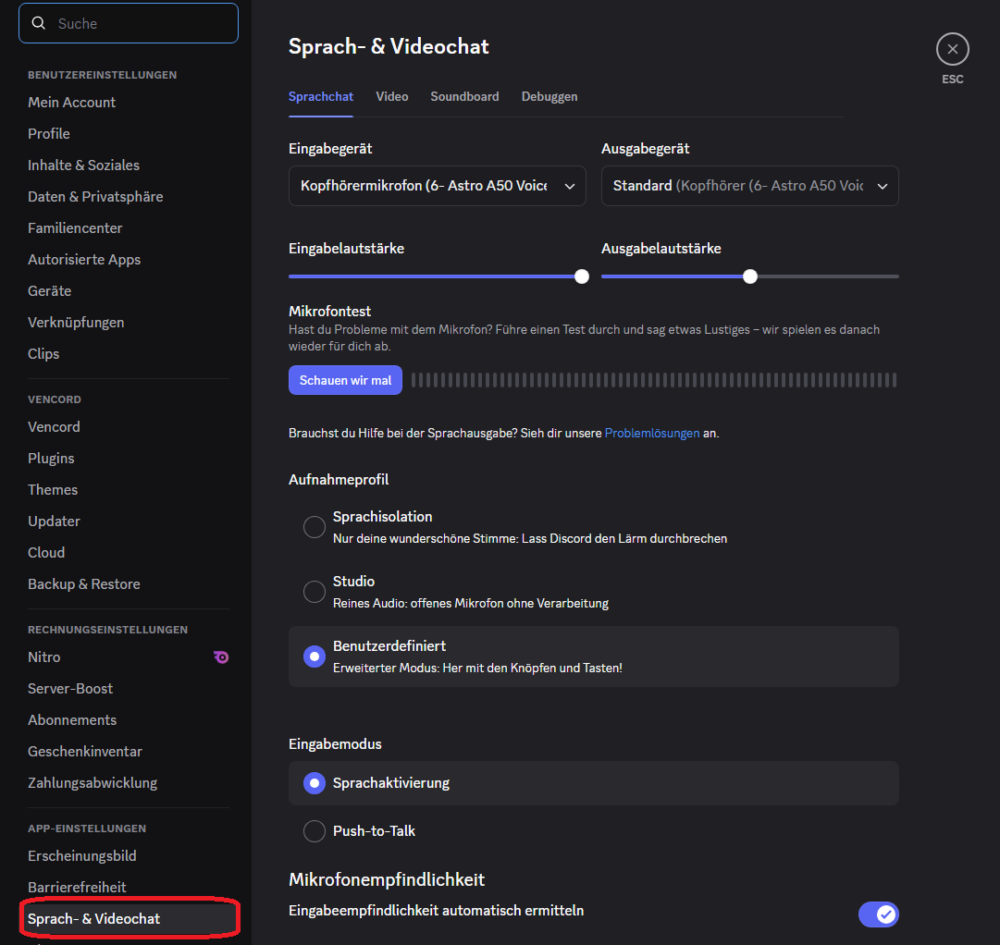
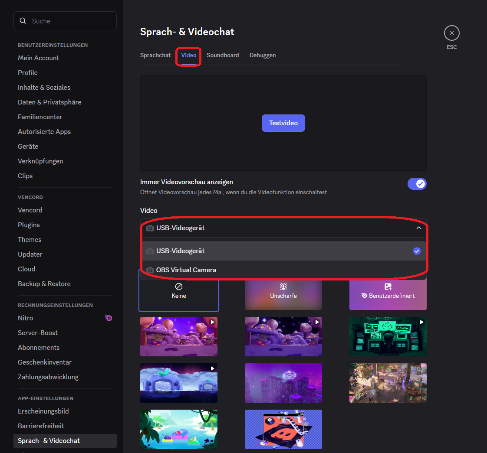
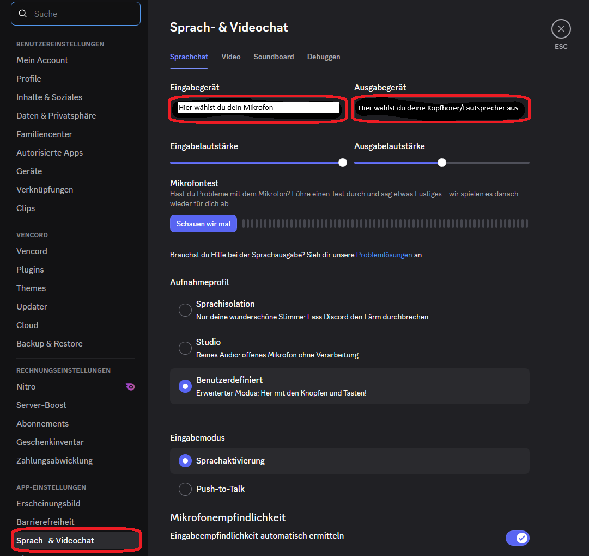
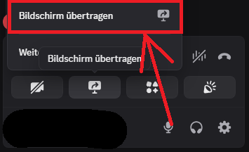
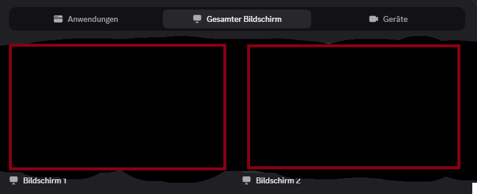
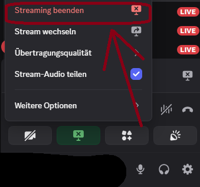

# 
Discord Audio & Bildschirm teilen

Diese Anleitung erklärt ausführlich, wie du in Discord die Audio-Einstellungen richtig konfigurierst und deinen Bildschirm teilst.

---

## Audio-Einstellungen in Discord einrichten

#### Schritt 1: Benutzereinstellungen öffnen
Klicke unten links im Discord-Fenster auf das Zahnrad-Symbol neben deinem Benutzernamen, um die „Benutzereinstellungen“ zu öffnen.

#### Schritt 2: Zum Reiter „Sprache & Video“ wechseln
Wähle im linken Menü den Bereich „Sprache & Video“ aus. Hier findest du alle relevanten Audio-Einstellungen.

#### Schritt 3: Eingabegerät auswählen
Unter „Eingabegerät“ wählst du dein Mikrofon aus. Achte darauf, dass es richtig verbunden und nicht stummgeschaltet ist.

#### Schritt 4: Ausgabegerät auswählen
Unter „Ausgabegerät“ bestimmst du den Lautsprecher oder Kopfhörer, über den du den Ton hörst.

#### Schritt 5: Empfindlichkeit einstellen oder automatische Erkennung nutzen
Du kannst die automatische Empfindlichkeit aktivieren, sodass Discord dein Mikrofonsignal automatisch anpasst, oder die Empfindlichkeit manuell über den Schieberegler einstellen.

#### Schritt 6: Rauschunterdrückung und Echo-Unterdrückung aktivieren
Aktiviere bei Bedarf Funktionen wie Rauschunterdrückung, Echo-Unterdrückung oder automatisches Verstärken, um die Audioqualität zu verbessern.

#### Schritt 7: Audio testen
Nutze die Funktion „Sprache testen“, um sicherzustellen, dass dein Mikrofon korrekt funktioniert und deine Stimme gut übertragen wird.

---

## 2. Bildschirm in Discord teilen

#### Schritt 1: Sprach- oder Video-Chat betreten
Tritt einem Sprachkanal in deinem Server bei oder starte einen privaten Sprach- oder Videoanruf.

#### Schritt 2: Bildschirm teilen starten
Klicke unten in der Steuerleiste auf das Symbol „Bildschirm teilen“. Du bekommst nun mehrere Optionen angezeigt.

#### Schritt 3: Empfehlung: Ganze Bildschirmübertragung statt einzelne Anwendung
Es lohnt sich, den ganzen Bildschirm zu teilen, statt nur eine einzelne Anwendung auszuwählen. Dadurch vermeidest du Probleme, wenn du während der Übertragung zwischen Programmen wechselst, und deine Zuschauer können alles auf deinem Bildschirm sehen.

#### Schritt 4: Bildschirm auswählen und Übertragung starten
Wähle deinen gesamten Bildschirm aus und klicke auf „Übertragen“. Jetzt wird dein Bildschirm für alle Teilnehmer sichtbar.

#### Schritt 5: Übertragung beenden
Um die Bildschirmübertragung zu beenden, klicke auf „Teilen beenden“ oder verlasse den Sprach- oder Video-Chat.

---

**Tipp:** Achte darauf, keine privaten oder sensiblen Informationen sichtbar zu haben, wenn du den ganzen Bildschirm teilst.

---

<a href="/docs/05-kommunikation/01-discord/01-einrichtung/README.md"><strong>Zurück</strong></a> | 
<a href="/docs/05-kommunikation/02-webcam/README.md"><strong>Weiter</strong></a>

<a href="/docs/05-kommunikation/README.md/#dieser-themenbereich-beinhaltet-folgende-themen"><strong>Zurück zur Themen-Übersicht</strong></a> | <a href="/docs/00-willkommen/README.md"><strong>Zurück zur Startseite des Wikis</strong></a>

