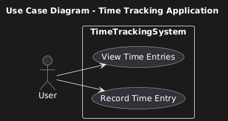
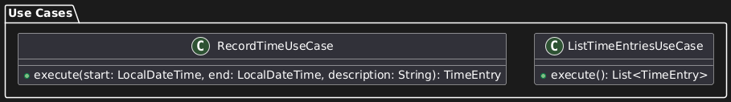

# Praxisbeispiel "Zeiterfassung": Anwendungsentwicklung mit Clean Architecture

Im folgenden soll die Anwendung der Clean Architecture-Philosophie anhand eines potenziell realen Projekts demonstriert werden. Ziel ist die Entwicklung einer Anwendung für die Erfassung von Zeiten. Hier ist zu Anfang nochmal das Schaubild der Schichten zur Erinnerung:


Okay, fangen wir an!

---

## Schritt 1: Projektstruktur einrichten

```plaintext
project-root/
├── entities/         # Kern-Domänenmodelle und Geschäftsregeln
├── usecases/         # Anwendungsspezifische Geschäftlogik
├── adapters/         # Schnittstellenadapter (Repositories, Controller, Presenter)
└── frameworks/       # Implementierungen der Infrastruktur (Datenbanken, UI, APIs)
```
#

📁 **entities/** – enthält die **Domänenmodelle (Entitäten)** und **grundlegende Geschäftslogik**, z.B. eine Klasse _TimeEntry_ für einen Zeiteintrag.

📁 **usecases/** – enthält die **Anwendungsfall-Logik**, z.B. die Klassen _RecordTime_ und _ListTimeEntries_ für „Zeit erfassen“ und „Zeiten anzeigen“.

📁 **adapters/** – enthält die **Schnittstellen-Adapter** zwischen Kern und Außenwelt, z.B. Implementierungen eines _TimeEntryRepository_ (Datenbankzugriff) sowie **Controller/Presenter** für UI oder API.

📁 **frameworks/** – enthält die konkreten **Framework- und Infrastruktur-Schichten**, z.B. eine Datenbankkonfiguration, Webserver-Code oder eine CLI-Anwendung, die unsere Use Cases aufruft.

#

Diese Struktur **trennt** klar die **Domäne (innen) von den technischen Details (außen)**. Als Nächstes füllen wir diese Schichten mit Inhalt.

---

## Schritt 2: Zentrale Use Cases definieren

Use Cases sind die **zentralen Anwendungsfälle**, die unser System unterstützen soll. Sie **definieren die Interaktionen zwischen dem Nutzer und dem System**. Im Kontext unseres Praxisbeispiels entscheiden wir uns für die folgenden Use Cases: <br><br>

### Use Case 1: „Zeit erfassen“ 

**Der Nutzer:** möchte eine neue _Arbeitszeit erfassen_. Dazu gibt er z.B. Startzeit, Endzeit und eine Beschreibung ein. 

**Die Anwendung:** soll daraus einen _Zeiteintrag erstellen und speichern_.

#

### Use Case 2: „Zeiten anzeigen“ 

**Der Nutzer:** möchte bereits _erfasste Arbeitszeiten einsehen_. 
**Die Anwendung:** soll eine _Liste der gespeicherten Zeiteinträge anzeigen_ (z.B. alle Einträge des Tages oder der Woche).

#

### Die definierten Use Cases im Anwendungsfalldiagramm:



---

Diese Use Cases sind **unabhängig von der konkreten Implementierung** und beschreiben nur, was der Nutzer tun möchte und was das System zurückgeben soll.

Durch das klare Definieren dieser Use Cases wissen wir, welche Funktionen unser System bieten muss. Jeder Use Case wird in der Clean Architecture später durch eine eigene **Interaktor-Klasse (Use-Case-Klasse)** repräsentiert, die **genau diese Aktion** durchführt:

<br>



---

### Schritt 3: Entities implementieren

Nun erstellen wir die **zentralen Entitäten der Domäne**. In unserer Zeiterfassung ist die wichtigste Entität ein Zeiteintrag, den wir als **Klasse** _TimeEntry_ umsetzen. Dieses **Domänenobjekt** hält die **relevanten Daten** eines Zeiteintrags und kann **ggf. geschäftslogische Regeln kapseln** (z.B. Validierung, dass die Endzeit nach der Startzeit liegt).

#

```java
// entities/TimeEntry.java
package entities;

import java.time.LocalDateTime;

public class TimeEntry {
    private LocalDateTime startTime;
    private LocalDateTime endTime;
    private String description;
    private int id;  // eindeutige ID des Eintrags (optional)

    public TimeEntry(LocalDateTime startTime, LocalDateTime endTime, String description) {
        if (endTime.isBefore(startTime)) {
            throw new IllegalArgumentException("Endzeit darf nicht vor der Startzeit liegen.");
        }
        this.startTime = startTime;
        this.endTime = endTime;
        this.description = description;
        // ID wird ggf. von der Datenbank oder Repository vergeben
    }

    // Getter/Setter und ggf. weitere Methoden, z.B. Dauer berechnen
    public LocalDateTime getStartTime() { return startTime; }
    public LocalDateTime getEndTime() { return endTime; }
    public String getDescription() { return description; }

    @Override
    public String toString() {
        return String.format("TimeEntry{id=%d, start=%s, end=%s, desc='%s'}",
                             id, startTime, endTime, description);
    }
}
```
#

Die _TimeEntry_-Klasse dient hier als "Blaupause" zur Erstellung von **Objekten** ("Kindern" der Entität) mit den **Attributen** (Eigenschaften) Start- und Endzeit sowie Beschreibung des Zeiteintrags. Eine optionale ID kann vom System vergeben werden (z.B. automatisch im Repository). In der **Konstruktor-Logik** könnten wir bereits Geschäftsregeln überprüfen (im Beispiel: die Endzeit darf nicht vor der Startzeit liegen). Weitere Domänenlogik ließe sich ebenfalls in Entities kapseln (z.B. Dauer eines Eintrags berechnen). 

#

### Die TimeEntry-Entität im Klassendiagramm:


---

### Schritt 4: Use Cases umsetzen

Als Nächstes implementieren wir die Use Cases _RecordTime_ (Zeit erfassen) und _ListTimeEntries_ (Zeiten auflisten). Diese Use-Case-Klassen gehören zur **Anwendungsschicht** und enthalten die **Ablauflogik für die definierten Szenarien**. 

⚠️ **Wichtig:** Use Cases sollten unabhängig von Details wie der Datenbank sein – sie arbeiten stattdessen mit **Abstraktionen (Schnittstellen)**, um z.B. auf ein Repository zuzugreifen.

Wir definieren zunächst also ein **Repository-Interface**, das **von der Domäne aus gesehen** die **Datenhaltung** repräsentiert (z.B. für Zeiteinträge speichern und laden). Dieses Interface wird im nächsten Schritt genauer erläutert. Die Use-Case-Klasse _RecordTimeUseCase_ nutzt das Interface, um den neuen Eintrag zu persistieren:

<br>

```java
// usecases/RecordTimeUseCase.java
package usecases;

import entities.TimeEntry;
import java.time.LocalDateTime;

public class RecordTimeUseCase {
    private final TimeEntryRepository repository;

    public RecordTimeUseCase(TimeEntryRepository repository) {
        this.repository = repository;
    }

    /** Führt den Use Case "Zeit erfassen" aus */
    public TimeEntry execute(LocalDateTime start, LocalDateTime end, String description) {
        // 1. Neuen Zeiteintrag erstellen (Domänen-Entität)
        TimeEntry entry = new TimeEntry(start, end, description);
        // 2. Über das Repository speichern
        repository.save(entry);
        // 3. Ergebnis zurückgeben (oder an Output-Presenter schicken)
        return entry;
    }
}
```

---
<br>

**Und analog dazu der Use Case zum Anzeigen der Zeiten:**

<br>

```java
// usecases/ListTimeEntriesUseCase.java
package usecases;

import entities.TimeEntry;
import java.util.List;

public class ListTimeEntriesUseCase {
    private final TimeEntryRepository repository;

    public ListTimeEntriesUseCase(TimeEntryRepository repository) {
        this.repository = repository;
    }

    /** Führt den Use Case "Zeiten anzeigen" aus */
    public List<TimeEntry> execute() {
        // Holt alle gespeicherten Zeiteinträge über das Repository
        return repository.findAll();
    }
}
```
#

In _RecordTimeUseCase_ sehen wir, dass der neue _TimeEntry_ erstellt und dann über _repository.save(...)_ gespeichert wird – **ohne zu wissen, wie** genau gespeichert wird. 

_ListTimeEntriesUseCase_ ruft **über das gleiche Repository-Interface** die Liste aller Einträge ab. Die Geschäftslogik (hier trivial: Erstellen bzw. Laden von Einträgen) ist damit **gekapselt**. 

Beide Use Cases **hängen nur von der Abstraktion _TimeEntryRepository_ ab**, nicht von einer konkreten Datenbank oder Liste.

🚩 **Hinweis:** In einer komplexeren Anwendung könnte _RecordTimeUseCase_ statt eines direkten Rückgabewerts auch einen Output-Presenter aufrufen, um z.B. eine Bestätigung oder aufbereitete Daten an die UI weiterzugeben. Für unser einfaches Beispiel genügt es, den neuen Eintrag zurückzugeben.

---

### Schritt 5: Schnittstellen (Input, Output, Gateways) definieren

Bisher haben wir im Code nur angedeutet, welche Schnittstellen zwischen den Schichten notwendig sind. In Clean Architecture sprechen wir hierbei häufig oft von **Ports und Gateways**:

<br>

ℹ️ **Input-Port:** definiert, ***wie ein Use Case von außen aufgerufen wird*** – ein Beispiel dafür ist die **Methode** _execute(...)_ unseres Use-Case-Objekts. Man könnte hier auch ein **Interface** vorsehen, das der Use Case implementiert, um den Aufruf weiter zu **abstrahieren**. In unserem einfachen Beispiel genügt jedoch die **öffentliche** Methode der Use-Case-Klasse als **Eingabeschnittstelle**.

ℹ️ **Output-Port:** definiert, ***wie der Use Case Ergebnisse an die äußere Schicht zurückliefert***. Oft wird hierfür ein **Presenter-Interface** verwendet, das z.B. eine **Methode** _presentTimeEntry(TimeEntry entry)_ bereitstellt. Unser _RecordTimeUseCase_ gibt den Eintrag direkt zurück, was in einfachen Fällen ausreichen kann. Alternativ könnte er _output.present(entry)_ aufrufen – die konkrete Präsentationslogik würde dann eine Implementierung des Output-Ports im äußeren Layer übernehmen.

ℹ️ **Gateways** (auch Datenbank- oder API-Schnittstellen): ***abstrahieren den Zugriff auf externe Systeme***. In unserem Fall dient _TimeEntryRepository_ als Gateway zur Datenhaltung.

---

Lass uns jetzt also explizit **das Repository-Interface für Zeiteinträge definieren**.

Dieses Interface gehört zur Domäne bzw. **Anwendungslogik (innere Schicht)** und **stellt die Methoden** bereit, die wir zum Speichern und Laden von _TimeEntry_-Objekten brauchen. Damit wenden wir das **Dependency-Inversion-Prinzip** an: 

💡 Die **innere Schicht definiert** den Vertrag, den die **äußere Schicht erfüllen** muss.

<br>

```java
// usecases/TimeEntryRepository.java  (Interface der Domäne)
package usecases;

import entities.TimeEntry;
import java.util.List;

public interface TimeEntryRepository {
    void save(TimeEntry entry);
    List<TimeEntry> findAll();
    // Optional: weitere Methoden, z.B. findById, delete etc.
}
```

---

Dieses Interface wird von den Use Cases verwendet, kennt aber keine Details der Implementierung. Die **konkrete Speicherung** (etwa in einer Datenbank oder in einer Liste) wird erst **in der äußeren Schicht entschieden**. Durch diese Schnittstelle bleibt unsere Geschäftslogik (Use Cases + Entities) **komplett unabhängig von der Datenbank-Technologie**.

### Zusammengefasst erstellen wir also Schnittstellen für alle Stellen, an denen die innere Logik mit etwas Äußerem kommuniziert:

➡️ Der **Input-Port** ist implizit die **Signatur der Use-Case-Methoden** (z.B. _execute_). <br>
➡️ Der **Output-Port** könnte ein **Presenter-Interface** sein (haben wir hier optional erwähnt). <br>
➡️ Das **Gateway-Interface** ist unser _TimeEntryRepository_ für die **Datenhaltung**. <br >

All diese Interfaces liegen innerhalb der Kernlogik und definieren Anforderungen, die außerhalb erfüllt werden. Damit „kennt“ die innere Schicht nur Abstraktionen, keine konkreten Klassen der äußeren Welt – ein zentrales Prinzip von Clean Architecture und **SOLID** (Dependency Inversion).

---

### Schritt 6: Adapter und äußere Schicht umsetzen

Im letzten Schritt kümmern wir uns um die Adapter in der äußeren Schicht, die unsere **Use Cases in ein laufendes System einbinden**. Wir betrachten zwei mögliche Ansätze:

1. Eine einfache **Konsolenanwendung (CLI)**, die die Use Cases **direkt** aufruft.
2. Eine **Web-API (REST)**, die **HTTP-Anfragen** annimmt und an die Use Cases **weiterleitet**.

Zur Veranschaulichung implementieren wir einen einfachen CLI-Adapter. Dabei nutzen wir ein **In-Memory Repository** (eine schnelle Implementierung von _TimeEntryRepository_, die die Daten in einer Liste hält) und rufen die Use Cases aus einer **_main_-Methode** heraus auf:

<br>

```java
// adapters/InMemoryTimeEntryRepository.java
package adapters;

import usecases.TimeEntryRepository;
import entities.TimeEntry;
import java.util.ArrayList;
import java.util.List;

public class InMemoryTimeEntryRepository implements TimeEntryRepository {
    private List<TimeEntry> storage = new ArrayList<>();

    @Override
    public void save(TimeEntry entry) {
        // einfache Speicherung in einer Liste
        // hier könnte auch eine ID vergeben werden, z.B. entry.setId(...)
        storage.add(entry);
    }

    @Override
    public List<TimeEntry> findAll() {
        return new ArrayList<>(storage);
    }
}
```

---

```java
// frameworks/TimeTrackerCLI.java
package frameworks;

import adapters.InMemoryTimeEntryRepository;
import usecases.RecordTimeUseCase;
import usecases.ListTimeEntriesUseCase;
import entities.TimeEntry;
import java.time.LocalDateTime;
import java.util.List;

public class TimeTrackerCLI {
    public static void main(String[] args) {
        // 1. Initialisierung der Abhängigkeiten (DI)
        InMemoryTimeEntryRepository repository = new InMemoryTimeEntryRepository();
        RecordTimeUseCase recordTime = new RecordTimeUseCase(repository);
        ListTimeEntriesUseCase listTimes = new ListTimeEntriesUseCase(repository);

        // 2. Use Case "Zeit erfassen" aufrufen (Beispieldaten)
        System.out.println("Erfasse neuen Zeiteintrag...");
        TimeEntry neuerEintrag = recordTime.execute(
            LocalDateTime.of(2025, 4, 1, 9, 0),
            LocalDateTime.of(2025, 4, 1, 17, 0),
            "Implementierung Clean Architecture"
        );
        System.out.println("Neuer Eintrag gespeichert: " + neuerEintrag);

        // 3. Use Case "Zeiten anzeigen" aufrufen
        System.out.println("\nListe aller erfassten Einträge:");
        List<TimeEntry> eintraege = listTimes.execute();
        for (TimeEntry e : eintraege) {
            System.out.println(" - " + e);
        }
    }
}
```

---

Führen wir _TimeTrackerCLI.main()_ aus, würde das Programm e**inen neuen Zeiteintrag erzeugen** und anschließend **alle Einträge auflisten**.

Hier übernimmt _TimeTrackerCLI_ die Rolle eines einfachen **Controllers**: Es **sammelt Eingaben** (in unserem Beispiel sind die Daten fest im Code vorgegeben), **ruft die Geschäftslogik auf** (_recordTime.execute(...)_ und _listTimes.execute()_) und **gibt die Ergebnisse** auf der Konsole **aus**.

Die Use Cases selbst sind dabei **völlig unverändert**, egal ob wir sie über eine Konsole, eine Web-API oder z.B. durch automatisierte Tests aufrufen – wir könnten anstelle der CLI auch einen **REST-Controller** schreiben, der die gleichen Use-Case-Methoden nutzt.

Für eine Web-API würde man z.B. einen **HTTP-Controller** implementieren, der die eingehenden **JSON**-Daten in die Parameter von _RecordTimeUseCase.execute_ umwandelt, und das Ergebnis (eine _TimeEntry_-Liste) wieder als JSON an den Client zurückgibt. Die Logik bleibt jedoch in den Use-Case-Klassen gekapselt, und **nur die Adapter-Schicht ändert sich je nach Rahmenwerk**.

---

### 🚀 Damit haben wir eine vollständige vertikale Scheibe unserer Zeiterfassungsanwendung umgesetzt: 

Von der **Domäne** (**Entity** _TimeEntry_),

über die **Anwendungsfälle** (**Use Cases**, _RecordTimeUseCase_, _ListTimeEntriesUseCase_ und Interface _TimeEntryRepository_),

bis zur **Infrastruktur** (_In-Memory-Repo_ und _CLI_ als einfache UI)!

Jetzt solltest du ein besseres Grundverständnis für die Prinzipien der Clean Architecture besitzen und dazu in der Lage sein, diese Konzepte in deinen eigenen Projekten anzuwenden. Bevor du dich aber in deine erste eigene Arbeit stürzt, schau dir unbedingt noch die wichtigsten [**Best Practices**](/docs/06-entwicklung/02-architekturen/01-clean_architecture/02-best_practices/README.md) an, die wir für dich im nächsten Abschnitt gebündelt zusammengetragen haben. Wenn du diese verinnerlichst, vermeidest du häufige Fallstricke und holst das Beste aus diesem Architekturansatz heraus.

---

<p align="center">
<a href="/docs/06-entwicklung/02-architekturen/01-clean_architecture/README.md"><strong>Zurück</strong></a> | 
<a href="/docs/06-entwicklung/02-architekturen/01-clean_architecture/02-best_practices/README.md"><strong>Weiter</strong></a>
</p>

<p align="center">
<a href="/docs/06-entwicklung/02-architekturen/01-clean_architecture/README.md/#dieses-kapitel-beinhaltet-folgende-abschnitte"><strong>Zurück zur Abschnitts-Übersicht</strong></a> | <a href="/docs/00-willkommen/README.md"><strong>Zurück zur Startseite des Wikis</strong></a>
</p>