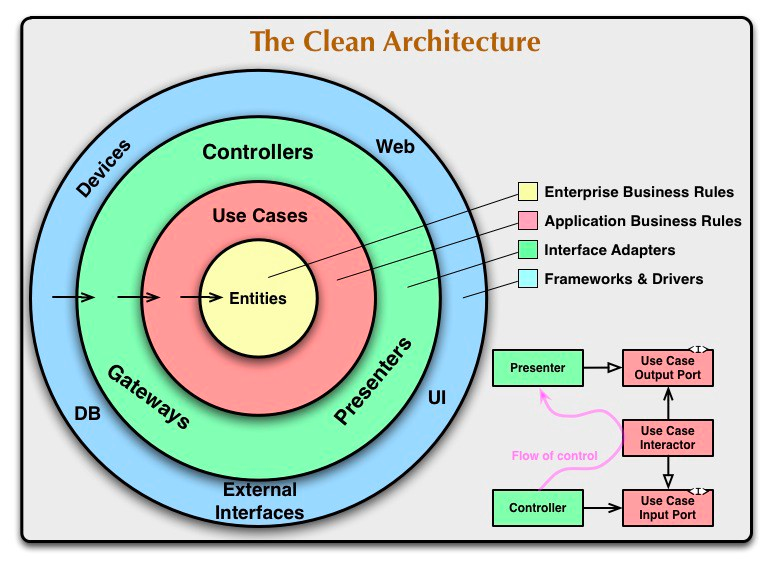

# 
Clean Architecture

<a href="#dieses-kapitel-beinhaltet-folgende-abschnitte">🚀 Direkt zur Abschnitts-Übersicht</a>

Clean Architecture ist ein Architekturstil für Softwaresysteme, der darauf abzielt, die Geschäftslogik vom Rest des Systems zu trennen, um Wartbarkeit, Flexibilität und Testbarkeit zu verbessern. Dies wird durch konzentrische Schichten erreicht, wobei die inneren Schichten die Geschäftsregeln enthalten und von äußeren Schichten wie Benutzeroberfläche und Datenbank entkoppelt sind. Das Hauptprinzip ist die Abhängigkeitsregel, die besagt, dass Abhängigkeiten nur nach innen zeigen dürfen, was die Geschäftslogik unabhängig von externen Frameworks und Technologien macht. 

Dieser Architekturstil eignet sich besonders für komplexen Anwendungen, die über längere Zeit laufen und abhängig von sich häufig ändernden Anforderungen entsprechend oft gewartet, angepasst und verändert werden müssen.

## Der allgemeine Aufbau - Das Schichtenmodell der Clean Architecture

Anhand des folgenden Schaubilds lässt sich die für Clean Architecure typische Unterteilung von Anwendungen in vier Schichten mit klar getrennten Verantwortlichkeiten erkennen:
 

---

### 🟨 Entities (Entitäten) / Enterprise Business Rules

Diese Schicht enthält die **Domänenmodelle mit den zentralen Geschäftsregeln und Datenstrukturen** des Systems. Diese Modelle bilden die **Kerngeschäftslogik** der Anwendung. 

👉 Diese Schicht **ändert sich am seltensten** und kann oft **wiederverwendet** werden.  
👉 Sie ist **unabhängig von äußeren Details** und definiert, wie zentrale Daten (z.B. ein Zeiteintrag) **strukturiert** und **validiert** werden.

#

### 🟥 Use Cases (Anwendungsfälle) / Application Business Rules

Die **anwendungsspezifische** Geschäftslogik, welche die **Abläufe für bestimmte Aktionen oder Szenarien definiert**. 

👉 Use Cases **orchestrieren** den **Datenfluss** zwischen den Entitäten und steuern die Abläufe der Anwendung. 
👉 Sie enthalten die Kernlogik dafür, **wie Entitäten miteinander interagieren** und **wie das System auf Eingaben reagiert**, ohne konkrete technische Abhängigkeiten zu kennen.

#

### 🟩 Interface Adapters (Schnittstellenadapter)

Diese Schicht enthält **Adapter und Vermittler zwischen der Domäne und der Außenwelt**. Typische Bestandteile sind **Controller für Eingaben** (z.B. UI- oder API-Aufrufe), **Presenter oder Output Boundary für Ausgaben/Aufbereitung von Daten** für die UI und **Gateways für den Datenaustausch mit externen Systemen** (z.B. Datenbanken oder Web-Services).

👉 Implementiert die Schnittstellen der Use-Case-Schicht und übersetzt Daten zwischen inneren und äußeren Formaten. 
👉 Übersetzt Datenformate und ruft beispielsweise die Use-Case-Methoden auf, um Ergebnisse für UI oder Datenbank zugänglich zu machen.

#

### 🟦 Frameworks and Drivers (Externe Rahmenwerke) 

Die äußerste Schicht mit allen technischen Details und Infrastruktur-Komponenten. Dazu zählen z.B. Datenbanken, Web-Frameworks, UI-Frameworks oder externe APIs. Diese Schicht enthält konkrete Implementierungen, die über Adapter an die innen liegenden Schichten angebunden sind. Ziel ist es, dass Änderungen an solchen externen Technologien minimalen Einfluss auf den Anwendungskern haben.

👉 Integriert externe Infrastruktur (z.B. Datenbanken, UI oder Geräte). 
👉 Abhängigkeits-Pfeile zeigen stets von außen nach innen, sodass Frameworks die Kernlogik nicht beeinflussen.

---

⚠️ **Wichtig:** Bei Clean Architecture hängt jede Schicht **nur von innen liegenden Schichten** ab, **nie umgekehrt**. Die innere Geschäftslogik kennt also keine Details der äußeren Schichten. Dieses Prinzip der **Abhängigkeitsumkehr (Dependency Inversion)** stellt sicher, dass die Domäne nicht von Frameworks oder Datenbanken beeinflusst wird.

---

## Der nächste Schritt

Damit du die Prinzipien der Clean Architecture leichter nachvollziehen kannst, haben wir für dich auf der nächsten Seite dieses Kapitels zur Veranschaulichung **ein kleines Praxisbeispiel** vorbereitet. Darin bauen wir gemeinsam Schritt für Schritt **eine einfache Zeiterfassungsanwendung** auf.

### 
Also, los geht's! 🚀

 

---

### 
Dieses Kapitel beinhaltet folgende Abschnitte:

---

◻️ [**Praxisbeispiel "Zeiterfassung": Anwendungsentwicklung mit Clean Architecture**](/docs/06-entwicklung/02-architekturen/01-clean_architecture/01-praxisbeispiel/README.md)  
◻️ [**Best Practices und Tipps für Einsteiger**](/docs/06-entwicklung/02-architekturen/01-clean_architecture/02-best_practices/README.md)  

---

<a href="/docs/06-entwicklung/02-architekturen/README.md"><strong>Zurück</strong></a> | 
<a href="/docs/06-entwicklung/02-architekturen/01-clean_architecture/01-praxisbeispiel/README.md"><strong>Weiter</strong></a>

<a href="/docs/06-entwicklung/02-architekturen/README.md/#dieses-thema-beinhaltet-folgende-kapitel"><strong>Zurück zur Kapitel-Übersicht</strong></a> | <a href="/docs/00-willkommen/README.md"><strong>Zurück zur Startseite des Wikis</strong></a>

