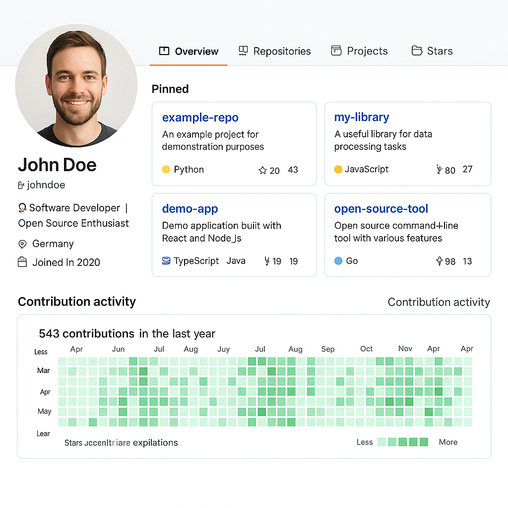

# 5.3.1 GitHub-Profil

---

## GitHub-Profil erstellen – Schritt für Schritt

Ein GitHub-Profil ist eine Art digitale **Visitenkarte für Entwicklerinnen und Entwickler**.

Es zeigt, an welchen Projekten man arbeitet, was man programmiert hat und wie gut man dadurch mit anderen innerhalb von Teams zusammenarbeitet.

---

## So erstellst du ein GitHub-Profil

1. **Zur GitHub-Webseite gehen:** Öffne [https://github.com](https://github.com) in deinem Browser.
2. **Ein Konto anlegen:** Klicke auf „Sign up“ und folge den Anweisungen. Du brauchst eine E-Mail-Adresse, einen Benutzernamen und ein Passwort.
3. **Profil einrichten:** Nach dem Login kannst du dein Profil personalisieren – zum Beispiel mit einem Foto, einer kurzen Beschreibung über dich, deinem Standort und einem Link zu deiner Webseite oder deinem Lebenslauf.
4. **README-Datei erstellen:** GitHub erlaubt es dir, eine besondere Datei mit dem Namen `README.md` im gleichnamigen Repository wie dein Benutzername zu erstellen. Diese Datei wird ganz oben in deinem Profil angezeigt. Hier kannst du dich kreativ vorstellen und deine Projekte hervorheben.

Beispiel: Wenn dein Benutzername `maxdev` ist, erstelle ein Repository mit dem Namen `maxdev` und füge eine `README.md` Datei hinzu.

---

## Warum lohnt sich ein gepflegtes GitHub-Profil?

- Ein gut gepflegtes GitHub-Profil kann viel über deine Fähigkeiten und dein Engagement zeigen – vor allem, wenn du regelmäßig zu Open-Source-Projekten beiträgst.

- Es ist zudem hilfreich, wenn auf deinem Profil ersichtlich wird, dass du dich mit mehreren Programmiersprachen auskennst oder bereit bist, dich in neue Technologien einzuarbeiten – das zeigt Vielseitigkeit und Lernbereitschaft.

Arbeitgeber und Teams achten zunehmend auf folgende Punkte:

- **Codequalität und Dokumentation**
- **Teamfähigkeit durch Pull Requests und Issues**
- **Lösungsorientiertes Arbeiten in echten Projekten**
- **Aktivität und Lernbereitschaft**

---

### 🚀 Sichtbarkeit erhöhen

Ein aktives GitHub-Profil kann dir helfen, in der Entwickler-Community sichtbar zu werden. Du kannst deine Projekte teilen, Feedback erhalten und dich mit anderen Entwicklern vernetzen.

Das ist besonders wichtig, wenn du auf der Suche nach neuen Jobmöglichkeiten oder Freelance-Projekten bist.

---

### 💡 Karrierevorteil

Wer sichtbar und aktiv an Open-Source-Projekten mitarbeitet, zeigt nicht nur Fachwissen, sondern auch Eigeninitiative und Teamgeist. Ein aussagekräftiges GitHub-Profil kann daher Türen zu spannenden Jobangeboten, Freelance-Projekten oder sogar zu Stipendien und Förderprogrammen öffnen.

---

## Fazit

Ein GitHub-Profil ist mehr als nur eine digitale Visitenkarte. Es ist ein wichtiges Werkzeug, um deine Fähigkeiten und Erfahrungen zu präsentieren und dich in der Entwickler-Community zu vernetzen.
Ein gut gepflegtes Profil kann dir helfen, deine Karriere voranzutreiben und neue Möglichkeiten zu entdecken.

Also, leg los und mach dein GitHub-Profil zu deinem persönlichen Schaufenster in der Welt der Softwareentwicklung! 🚀

---

## Weitere Informationen

- [GitHub-Profil erstellen](https://docs.github.com/de/get-started/start-your-journey/setting-up-your-profile)
