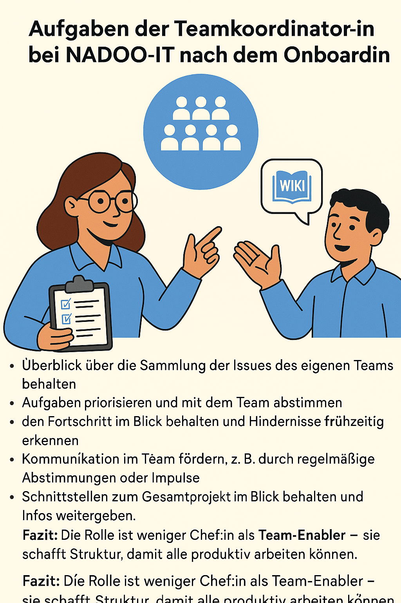

# 5.4 Teamkoorodinationsrollen

Bereits kurz nach dem Onboarding-Prozess erhältst Du die Möglichkeit Verantwortung in Teamkoordinationsrollen zu übernehemn.

Das ist **nicht verpflichtend** - aber eine **gute Gelegenheit**, Deine **Fähigkeiten** in der Teamkoordination zu **entwickeln!**

Du wirst hierbei in die Planung und Koordination von Projekten eingebunden und erhältst dadurch Einblicke in die Teamdynamik.

Nach dem Onboarding kanst Du dadurch Dein 11er-Team unterstützen und Deine Fähigkeiten in der Teamkoordination weiterentwickeln.
Das ist eine gute Gelegenheit, Deine Fähigkeiten in der Teamkoordination zu entwickeln.

Dabei steht nicht die Leitung, sondern **Begleitung, Anleitung und Unterstützung** im Vordergrund.

---

Typische Aufgaben sind:

- Vorbereitung des Protokolls der wöchentlichen 11er Team-Meetings für Montag, Dienstag und Donnerstag
- Koordination der Aufgabenverteilung im Team
- Unterstützung bei der Planung von Sprints
- Unterstützung bei der Planung von Team-Meetings
- Überblick über die Sammlung der Issues des eigenen Teams behalten
- Aufgaben priorisieren und mit dem Team abstimmen
- den Fortschritt im Blick behalten und Hindernisse frühzeitig erkennen
- Kommunikation im Team fördern, z. B. durch regelmäßige Abstimmungen oder Impulse
- Schnittstellen zum Gesamtprojekt im Blick behalten und Infos weitergeben

---

👉 Beispiel: Die Teamkoordinator:in des 11er-Teams „Launch“ sammelt Issues rund um die Unterstützung neuer Teammitglieder – vor allem durch Inhalte im NADOO-Wiki. Sie sorgt dafür, dass hilfreiche Informationen aktuell, auffindbar und verständlich sind, und motiviert das Team, offene Fragen schnell aufzugreifen.

Fazit: Die Rolle ist weniger Chef:in als **Team-Enabler** – sie schafft Struktur, damit alle produktiv arbeiten können. Das Team hat die Verantwortung, die Aufgaben zu erledigen und die Qualität der Arbeit zu sichern.

Die Teamkoordinator:in ist dafür da, dass alle im Team ihre Aufgaben gut erledigen können.

---
